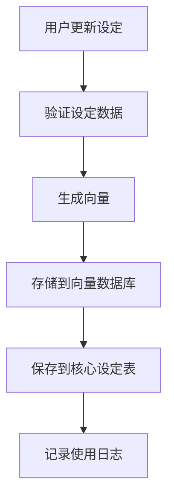

# 星夜创作引擎一致性检查系统集成说明

## 概述

本文档详细说明了如何将数据库中的一致性检查系统与星夜创作引擎进行集成，实现完整的AI创作内容一致性检查功能。

## 系统架构

### 1. 核心组件

#### 1.1 数据库层
- **用户一致性配置表** (`user_consistency_configs`) - 存储用户的个性化配置
- **一致性检查报告表** (`consistency_reports`) - 记历每次检查的详细报告
- **核心设定存储表** (`core_settings`) - 存储项目的核心设定信息
- **向量数据库配置表** (`vector_db_configs`) - 管理向量数据库连接配置
- **嵌入式模型配置表** (`embedding_model_configs`) - 管理嵌入式模型配置
- **冲突记录表** (`consistency_conflicts`) - 记录具体的冲突问题
- **使用日志表** (`vector_db_usage_logs`) - 记录向量数据库使用情况

#### 1.2 模型层
- `UserConsistencyConfig` - 用户配置管理模型
- `ConsistencyReport` - 检查报告管理模型
- `CoreSetting` - 核心设定管理模型
- `VectorDbConfig` - 向量数据库配置模型
- `EmbeddingModelConfig` - 嵌入式模型配置模型
- `ConsistencyConflict` - 冲突记录管理模型
- `VectorDbUsageLog` - 使用日志管理模型

#### 1.3 服务层
- `ConsistencyCheckIntegrationService` - 集成服务，连接数据库层与引擎层

#### 1.4 引擎层
- `StarryNightEngine` - 星夜创作引擎核心
- `EnhancedRAGService` - 增强RAG服务
- `VectorEmbeddingService` - 向量嵌入服务
- `AdvancedConsistencyChecker` - 高级一致性检查器

## 2. 集成流程

### 2.1 一致性检查流程

```mermaid
graph TD
    A[用户提交内容] --> B[获取用户配置]
    B --> C{是否启用一致性检查?}
    C -->|否 D[返回未启用状态]
    C -->|是 E[创建检查报告]
    E --> F[获取项目核心设定]
    F --> G[构建引擎请求]
    G --> H[调用星夜引擎]
    H --> I[解析检查结果]
    I --> J[保存冲突记录]
    J --> K[更新报告状态]
    K --> L[返回检查结果]
```

### 2.2 核心设定管理流程



## 3. 关键功能实现

### 3.1 一致性检查服务 (`ConsistencyCheckIntegrationService`)

#### 3.1.1 主要方法

**`performConsistencyCheck()`** - 执行一致性检查
```php
public function performConsistencyCheck(
    int $userId, 
    string $content, 
    int $projectId, 
    string $projectType, 
    ?int $contentId = null, 
    ?string $contentType = null
): array
```

**功能特点：**
- 自动获取用户配置
- 支持多种项目类型（小说、动漫、音乐）
- 完整的错误处理和日志记录
- 详细的执行时间统计

**`updateCoreSettings()`** - 更新核心设定
```php
public function updateCoreSettings(
    int $userId, 
    int $projectId, 
    string $projectType, 
    array $settings
): bool
```

**功能特点：**
- 自动生成向量并存储
- 支持批量更新
- 完整的元数据支持

### 3.2 配置管理

#### 3.2.1 用户配置选项

- **向量数据库模式**：单一/多向量数据库
- **嵌入式模型选择**：平台预设/用户自定义
- **检查频率**：实时/定时/手动
- **检查范围**：当前章节/当前项目/所有项目
- **敏感度设置**：0.00-1.00

#### 3.2.2 向量数据库支持

**支持的向量数据库：**
- Pinecone
- Weaviate
- Milvus
- Chroma

**配置功能：**
- 连接测试
- 健康状态检查
- 性能监控

#### 3.2.3 嵌入式模型支持

**平台预设模型：**
- OpenAI Embedding (ADA-002, 3-Small, 3-Large)
- BGE M3
- Sentence-BERT

**自定义模型：**
- 支持自定义API Key和Base URL
- 模型测试功能
- 性能统计

### 3.3 冲突管理

#### 3.3.1 冲突类型分类

- **逻辑冲突** - 内容逻辑不一致
- **角色设定冲突** - 角色行为与设定不符
- **世界观设定冲突** - 世界观元素矛盾
- **时间线冲突** - 时间顺序错误
- **情节冲突** - 情节发展不合理
- **风格冲突** - 写作风格不一致
- **连续性冲突** - 内容连续性问题

#### 3.3.2 严重程度分级

- **低** - 轻微问题，建议关注
- **中** - 中等问题，需要修正
- **高** - 严重问题，必须修正
- **严重** - 关键问题，立即修正

### 3.4 报告生成

#### 3.4.1 报告内容结构

```json
{
    "pass": true,
    "score": 85,
    "violations": [
        {
            "type": "character",
            "severity": "medium",
            "description": "角色行为与设定不符",
            "suggestion": "建议调整角色行为以符合设定"
        }
    ],
    "warnings": [],
    "details": {
        "check_time": "2024-01-01 12:00:00",
        "model_used": "gemini-pro",
        "execution_time": 1500,
        "tokens_used": 250
    }
}
```

## 4. 使用示例

### 4.1 执行一致性检查

```php
$integrationService = new ConsistencyCheckIntegrationService();

$result = $integrationService->performConsistencyCheck(
    $userId = 123,
    $content = "这是要检查的小说章节内容...",
    $projectId = 456,
    $projectType = 'novel',
    $contentId = 789,
    $contentType = 'chapter'
);

if ($result['success']) {
    echo "检查完成，报告ID: {$result['report_id']}";
    echo "通过状态: " . ($result['pass'] ? '通过' : '未通过');
    echo "发现冲突数量: {$result['conflicts_count']}";
} else {
    echo "检查失败: " . $result['error'];
}
```

### 4.2 更新核心设定

```php
$settings = [
    [
        'type' => 'character',
        'key' => '主角_性格',
        'value' => '勇敢、善良、有正义感',
        'metadata' => ['source' => '第一章', 'importance' => 'high']
    ],
    [
        'type' => 'worldview',
        'key' => '魔法系统',
        'value' => '基于元素魔法的系统，需要咒语和法力值',
        'metadata' => ['complexity' => 'medium']
    ]
];

$success = $integrationService->updateCoreSettings(
    $userId = 123,
    $projectId = 456,
    $projectType = 'novel',
    $settings = $settings
);

if ($success) {
    echo "核心设定更新成功";
} else {
    echo "核心设定更新失败";
}
```

### 4.3 获取用户配置

```php
$config = $integrationService->getUserConsistencyConfig(123);

echo "用户配置状态: " . ($config['config']['is_enabled'] ? '已启用' : '未启用');
echo "向量数据库模式: " . $config['config']['db_mode'];
echo "嵌入式模型: " . $config['config']['embedding_model'];
echo "检查频率: " . $config['config']['check_frequency'];
```

### 4.4 获取统计信息

```php
$stats = $integrationService->getConsistencyStats(
    $userId = 123,
    $dateRange = 'month'
);

echo "总报告数: " . $stats['summary']['total_reports'];
echo "成功率: " . $stats['summary']['success_rate'] . "%";
echo "总冲突数: " . $stats['summary']['total_conflicts'];
echo "平均执行时间: " . $stats['summary']['avg_execution_time'] . "ms";
```

## 5. 系统监控

### 5.1 健康状态检查

```php
$health = $integrationService->getSystemHealthStatus();

echo "系统状态: " . $health['overall'];
echo "RAG服务状态: " . $health['rag_service']['overall'];
echo "向量服务状态: " . $health['vector_service']['status'];
echo "最近错误数: " . count($health['recent_errors']);
```

### 5.2 性能监控

系统提供多维度的性能监控：
- 检查执行时间统计
- Token使用量统计
- 向量数据库操作统计
- 错误率统计
- 用户活跃度统计

## 6. 配置管理

### 6.1 向量数据库配置

```php
// 测试连接
$result = VectorDbConfig::testConnection($configId);

if ($result['success']) {
    echo "向量数据库连接成功";
} else {
    echo "连接失败: " . $result['error'];
}
```

### 6.2 嵌入式模型配置

```php
// 测试模型
$result = EmbeddingModelConfig::testModel($modelId, "测试文本");

if ($result['success']) {
    echo "模型测试成功";
    echo "向量维度: " . $result['embedding_dimension'];
    echo "Token使用量: " . $result['tokens_used'];
} else {
    echo "模型测试失败: " . $result['error'];
}
```

## 7. 最佳实践

### 7.1 性能优化

1. **批量处理** - 对于大量设定更新，使用批量操作
2. **缓存配置** - 缓存用户配置以减少数据库查询
3. **异步处理** - 对于耗时操作，考虑异步处理
4. **向量优化** - 合理设置向量维度和分块大小

### 7.2 错误处理

1. **完整日志** - 记录详细的错误信息和堆栈
2. **用户友好** - 向用户提供清晰的错误信息
3. **优雅降级** - 在服务不可用时提供降级方案
4. **重试机制** - 对于临时性错误实现重试

### 7.3 安全考虑

1. **权限控制** - 确保用户只能访问自己的数据
2. **数据加密** - 敏感配置信息加密存储
3. **输入验证** - 严格验证所有输入数据
4. **审计日志** - 记录重要操作的审计日志

## 8. 扩展性设计

### 8.1 插件化架构

系统采用插件化设计，支持：
- 自定义一致性检查规则
- 自定义冲突类型
- 自定义严重程度分级
- 自定义报告格式

### 8.2 API接口

提供完整的RESTful API接口：
- 配置管理API
- 检查执行API
- 报告查询API
- 统计分析API

## 9. 部署建议

### 9.1 环境要求

- PHP 8.1+
- MySQL 8.0+ 或 PostgreSQL 12+
- 向量数据库服务（可选）
- 足够的内存和存储空间

### 9.2 配置建议

- 生产环境启用缓存
- 合理设置数据库连接池
- 配置适当的超时时间
- 启用日志轮转

## 10. 故障排除

### 10.1 常见问题

1. **向量数据库连接失败**
   - 检查网络连接
   - 验证配置参数
   - 查看防火墙设置

2. **检查结果不准确**
   - 调整敏感度设置
   - 更新核心设定
   - 检查嵌入式模型配置

3. **性能问题**
   - 优化向量维度
   - 调整批处理大小
   - 启用缓存机制

### 10.2 调试工具

- 详细的执行日志
- 性能分析工具
- 配置验证工具
- 健康检查工具

---

本说明文档涵盖了星夜创作引擎一致性检查系统的完整集成方案，为开发人员提供了详细的实现指导和最佳实践建议。