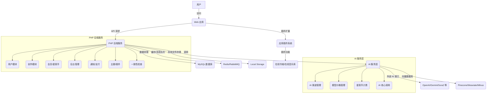
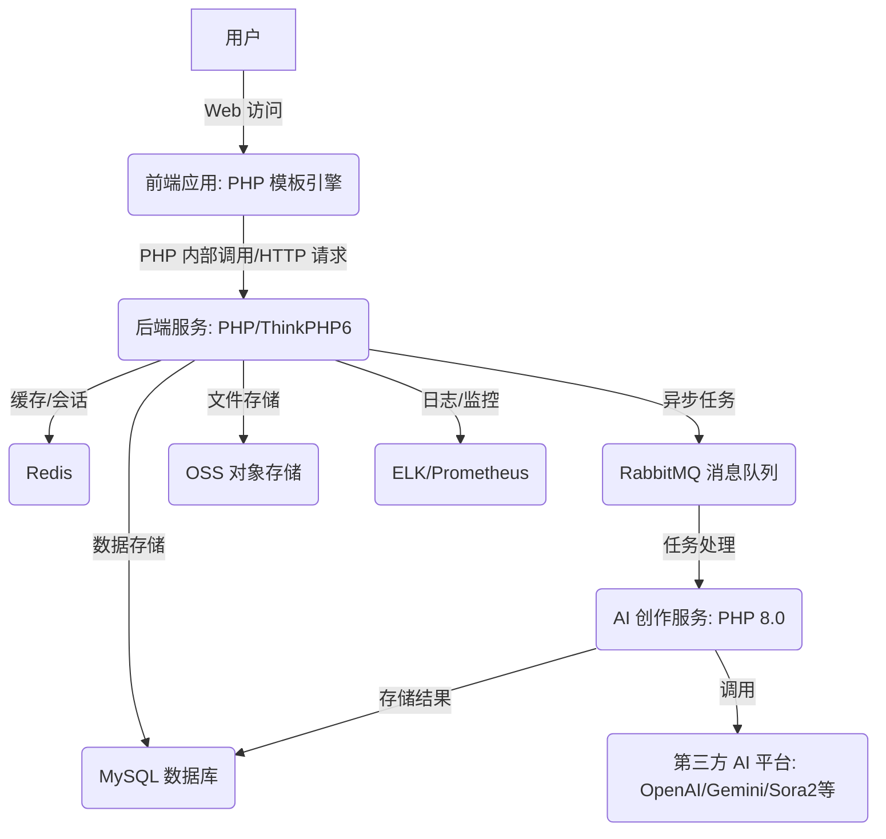

# 星夜阁 AI 创作平台 - 综合功能设计方案

## 一、项目概述

### 1.1 项目定位
星夜阁是一个集成 AI 小说创作、动漫制作、音乐创作于一体的多模态 AI 创作平台。

### 1.2 核心价值
- **AI 小说创作**：提供智能编辑器、大纲生成、角色管理、知识库等专业写作工具
- **AI 动漫制作**：支持从脚本到成品的全流程动漫创作
- **AI 音乐创作**：提供歌词、旋律、编曲、混音等音乐制作功能
- **统一管理**：星夜币管理系统、会员体系、AI 渠道管理

### 1.3 参考对标
基于灵犀速写（lingxisuxie.com）的核心功能进行扩展：
- 智能编辑器
- AI 智能体系统
- 内容管理系统
- 拆书仿写
- 智能分析
- 提示词工程
- 模板库系统

---

## 二、AI 小说创作板块

### 2.1 核心功能模块

#### 2.1.1 智能编辑器
**功能描述**：
- 富文本编辑器，支持实时保存
- AI 辅助写作：续写、改写、扩写、润色
- 章节管理：创建、编辑、删除、排序
- 版本历史：自动保存历史版本，支持回溯

**AI 提示词模板（Gemini 3 Pro）**：
```
续写提示词：
你是一位资深小说作家。根据以下内容继续创作：
【上文内容】：{context}
【人物设定】：{characters}
【情节要求】：{plot_requirements}
【风格要求】：{style}
请继续创作 {word_count} 字的内容，保持风格统一，情节连贯。
```

#### 2.1.2 大纲生成系统
**功能描述**：
- 根据题材、类型生成小说大纲
- **支持章节级、情节点级、细纲级大纲**
- 大纲可视化展示（树状图）
- 大纲编辑、调整、扩展

**AI 提示词模板**：
```
大纲生成提示词：
你是一位经验丰富的小说策划师。请根据以下要求生成小说大纲：
【题材】：{genre}
【类型】：{type}
【主题】：{theme}
【目标字数】：{target_words}
【核心冲突】：{conflict}

请生成包含以下内容的详细大纲：
1. 故事背景与世界观
2. 主要角色设定（至少3个）
3. 核心情节线（起承转合）
4. 章节规划（每章核心事件）
5. 高潮设计
6. 结局方向

要求：结构完整、逻辑清晰、冲突设置合理。
```

#### 2.1.3 角色管理系统
**功能描述**：
- 角色档案：姓名、年龄、性格、背景、能力
- 角色关系图：可视化展示角色关系
- **角色生成：AI 辅助生成角色设定（包含人设生成）**
- 角色一致性检查：确保角色行为符合设定

**AI 提示词模板**：
```
角色生成提示词：
你是一位角色设计专家。请根据以下要求创建角色：
【角色类型】：{role_type}（主角/配角/反派）
【故事背景】：{story_background}
【性格特点】：{personality_hints}
【故事作用】：{story_function}

请生成包含以下内容的角色档案：
1. 基本信息：姓名、年龄、性别、职业
2. 外貌描写：具体而有特色
3. 性格特征：优点、缺点、矛盾点
4. 背景故事：成长经历、关键事件
5. 能力特长：擅长什么、弱点是什么
6. 人物动机：核心追求、恐惧、价值观
7. 关系网络：与其他角色的关系

要求：立体丰满、有成长空间、符合故事逻辑。
```

#### 2.1.4 章节分析系统
**功能描述**：
- 章节质量评估：评分、优缺点分析
- 情节分析：节奏、冲突、转折
- 角色表现分析：行为合理性、成长轨迹
- 改进建议：具体的修改方向

**AI 提示词模板**：
```
章节分析提示词：
你是一位资深文学编辑。请对以下章节进行专业分析：
【章节内容】：{chapter_content}
【角色设定】：{character_settings}
【情节背景】：{plot_background}

请从以下维度分析：
1. 情节评估（1-10分）
   - 节奏：是否合理
   - 冲突：是否突出
   - 转折：是否自然
   
2. 角色表现（1-10分）
   - 行为合理性
   - 对话质量
   - 情感刻画
   
3. 文笔质量（1-10分）
   - 语言流畅度
   - 描写生动性
   - 氛围营造
   
4. 具体建议
   - 需要加强的地方（至少3点）
   - 可以删减的内容
   - 修改方向

输出格式：评分 + 详细分析 + 具体建议
```

#### 2.1.5 拆书仿写功能（来自灵犀速写）
**功能描述**：
- 上传或输入参考作品段落
- AI 分析写作技巧、风格特点
- 生成仿写练习提示
- 对比原文与仿写效果

**AI 提示词模板**：
```
拆书分析提示词：
你是一位文学分析专家。请分析以下文本的写作技巧：
【参考文本】：{reference_text}

请分析：
1. 写作技巧
   - 叙事视角
   - 描写手法
   - 修辞技巧
   
2. 风格特点
   - 语言风格
   - 节奏控制
   - 氛围营造
   
3. 结构特点
   - 段落安排
   - 信息展示顺序
   - 留白技巧

4. 仿写建议
   - 可以学习的技巧
   - 练习方向
   - 注意事项

---

仿写提示词：
基于以上分析，请仿照该风格创作：
【仿写主题】：{new_theme}
【仿写要求】：{requirements}
请创作 {word_count} 字的内容，保持原文的风格和技巧。
```

### 2.2 AI 小说创作工具集
**功能描述**：
- **前端用户直接使用**：所有工具均通过前端界面提供，用户可直接点击使用，无需后台管理创建。
- **黄金开篇生成器**：根据用户输入，生成吸引读者心弦的开篇，奠定作品基调。
- **书名生成器**：根据小说内容或关键词，智能生成爆款书名，吸引读者眼球。
- **简介生成器**：精炼吸睛的简介，让读者欲罢不能。
- **金手指生成器**：为小说设计出其不意的剧情转折或特殊能力，让故事峰回路转。
- **名字生成器**：生成独特而富有寓意的人名、地名、势力名等。
- **封面描述生成器**：根据小说内容，生成精美的封面描述，为作品增添视觉吸引力。
- **短篇创作**：提供专门的短篇小说创作模式，帮助用户精炼故事。
- **短剧剧本**：提供专业短剧剧本创作工具，帮助用户打造精彩剧情脚本。

**AI 提示词模板（示例）**：
```
黄金开篇生成提示词：
你是一位资深小说编辑。请根据以下信息，为小说创作一个引人入胜的开篇：
【小说类型】：{novel_type}
【核心主题】：{core_theme}
【主要人物】：{main_character_description}
【开篇氛围】：{opening_atmosphere}
请创作一个约 {word_count} 字的开篇，要求悬念迭起，引人入胜。
```

```
书名生成提示词：
你是一位爆款书名策划师。请根据以下小说信息，生成5个吸引人的书名：
【小说类型】：{novel_type}
【核心主题】：{core_theme}
【关键词】：{keywords}
要求：简洁、有力、有记忆点。
```

---

## 三、通用 AI 辅助系统

### 3.1 通用知识库系统（RAG）
**功能描述**：
- 知识条目管理：世界观、设定、专业知识
- 知识分类：按类型、标签分类
- 智能检索：根据创作内容自动关联知识
- 知识引用：在创作时引用知识库内容
- **用户上传与管理**：用户可上传自己的文档、文本作为私有知识库。
- **知识库分享与交易**：用户可将自己的知识库设置为公开，供其他用户浏览、学习，并可设置星夜币购买权限。

**AI 提示词模板**：
```
知识库辅助创作提示词：
你是一位创作顾问。根据以下知识库和创作需求，提供创作建议：
【相关知识】：
{knowledge_items}

【当前创作内容】：{current_text}
【创作需求】：{requirement}

请基于知识库内容：
1. 检查内容与设定的一致性
2. 提供可以引用的知识点
3. 建议如何更好地融入设定
4. 指出可能的逻辑矛盾

要求：确保世界观统一、细节准确。
```

### 3.2 通用提示词工程系统
**功能描述**：
- 提示词模板库：预设各类创作提示词
- 自定义提示词：用户创建个性化提示词
- 提示词管理：保存、分类、编辑
- 效果评估：记录提示词使用效果
- **用户上传与管理**：用户可上传自己的提示词模板。
- **提示词分享与交易**：用户可将自己的提示词模板设置为公开，供其他用户浏览、学习，并可设置星夜币购买权限。

**提示词分类**：
- 续写类
- 改写类
- 扩写类
- 分析类
- 生成类
- 动漫创作类
- 音乐创作类

### 3.3 通用模板库系统
**功能描述**：
- **预设模板**：提供各类创作模板，涵盖小说、动漫、音乐等不同创作模块的开头、情节、结局、风格等。
- **自定义模板**：用户可创建、编辑和保存自己的个性化模板。
- **模板分类**：按创作模块、题材、类型、用途等进行分类管理。
- **模板应用**：在创作过程中一键应用模板，提高创作效率。
- **用户上传与管理**：用户可上传自己的模板。
- **模板分享与交易**：用户可将自己的模板设置为公开，供其他用户浏览、学习，并可设置星夜币购买权限。

**模板分类**：
- **小说模板**：开头模板（悬念式、铺垫式）、情节模板（反转、误会）、对话模板、结局模板。
- **动漫模板**：企划模板、脚本模板、角色设计模板、场景设计模板、分镜模板。
- **音乐模板**：歌词模板、旋律模板、编曲模板、混音模板。

### 3.4 通用智能体系统
**功能描述**：
- **预设智能体**：提供多种预设智能体，如编辑助手、情节顾问、角色专家、世界观守护者等，可应用于不同创作模块。
- **自定义智能体**：用户可配置智能体的角色、能力、专属提示词、可用模型等，创建个性化智能体。
- **多智能体协作**：不同智能体可协同工作，为用户提供多角度的创作辅助。
- **智能体管理**：用户可启用、停用、调整、删除自己的智能体。
- **用户上传与管理**：用户可上传自己创建的智能体配置。
- **智能体分享与交易**：用户可将自己的智能体设置为公开，供其他用户浏览、学习，并可设置星夜币购买权限。

**智能体类型**：
- **通用助手**：文字润色、错别字检查、语法修正。
- **小说智能体**：情节顾问、角色专家、世界观守护者、文风分析师。
- **动漫智能体**：分镜指导、场景构建师、角色形象设计师。
- **音乐智能体**：作曲助手、编曲顾问、混音工程师。

### 3.5 通用资源分享平台
**功能描述**：
- **内容浏览与搜索**：用户可浏览、搜索其他用户分享的知识库、提示词、模板和智能体。
- **导入自用**：用户可将分享平台上的资源导入到自己的私有库中。
- **星夜币购买**：对于设置为付费的资源，用户可使用星夜币进行购买。
- **分享设置**：用户可管理自己分享的资源，包括公开/私有、定价、简介等。
- **评价与收藏**：用户可对分享内容进行评价和收藏。

---

### 3.6 通用创作工具集
**功能描述**：
- **前端用户直接使用**：所有工具均通过前端界面提供，用户可直接点击使用，无需后台管理创建。
- **世界观生成器**：根据用户输入的关键词或概念，智能生成丰富多彩的世界设定，包括地理、历史、文化、种族、魔法/科技系统等，为创作奠定基础。
- **脑洞生成器**：提供天马行空的创意灵感，激发用户无限想象空间，帮助用户突破创作瓶颈，生成新颖的情节、角色或设定。

**AI 提示词模板（示例）**：
```
世界观生成提示词：
你是一位世界观构建大师。请根据以下核心概念，生成一个详细的世界观设定：
【核心概念】：{core_concept}
【世界类型】：{world_type}（例如：奇幻、科幻、武侠、都市异能）
【主要冲突】：{main_conflict}
请生成包含以下内容的世界观：
1. 地理环境与主要区域
2. 历史背景与关键事件
3. 社会结构与文化风俗
4. 种族/势力设定
5. 魔法/科技系统（如果适用）
要求：逻辑自洽、细节丰富、具有扩展性。
```

```
脑洞生成提示词：
你是一位创意无限的灵感大师。请根据以下创作需求，提供3个独特的脑洞：
【创作主题】：{creation_theme}
【当前困境】：{current_dilemma}
要求：新颖、有启发性、可发展成具体情节。
```

---

## 四、一致性检查系统

### 4.1 核心功能
**功能描述**：
- **全自动化核心设定管理**：
  - **自动分析与重组**：在创作项目（如小说章节）完成后，系统自动分析内容中重要的人物行为、性格、关键事件等核心要素，并将其重组、更新到向量数据库中。
  - **实时比对与预警**：在 AI 模型进行下一阶段创作（如生成下一章内容）前，系统自动与向量数据库中的核心设定进行比对，检查潜在的一致性问题。
  - **创作核心设定存储与管理**：
    - **小说模块**：存储并管理小说的世界观、时间线、地理设定、魔法/科技系统、重要人物设定、关键事件等核心要素。
    - **动漫模块**：存储并管理动漫的企划核心、角色形象与性格、关键场景设定、分镜核心理念、剧情主线等。
    - **音乐模块**：存储并管理音乐的风格、主题、核心旋律、情感走向、乐器配置等。
- **多模态关联与交叉检查**：支持在不同创作模块之间进行核心设定的一致性检查，例如小说世界观与动漫场景的一致性。
- **用户端配置**：用户可在个人设置中配置是否开启一致性检查功能，默认关闭。
- **实时集成检查**：一致性检查将实时集成到 AI 生成流程中，自动在 AI 模型创作前进行。
- **冲突识别与预警**：自动识别内容中与核心设定不符的逻辑冲突、设定矛盾、角色行为偏差等问题，并进行预警。
- **智能建议与修正**：针对识别出的问题，提供基于核心设定的智能修改建议和优化方案。
- **可视化报告与追溯**：生成一致性检查报告，清晰展示问题点、影响范围和建议，并支持追溯到具体的设定来源。

### 4.2 技术架构
**核心技术**：
- **向量数据库（Vector Database）**：作为内核，存储和检索创作内容的嵌入向量。
    - **模式选择**：
        - **单一向量数据库**：所有模块内容（小说、动漫、音乐）的嵌入向量统一存储在一个向量数据库中。
        - **多向量数据库**：根据不同内容类型或模块，使用独立的向量数据库进行存储，例如小说内容一个库，动漫内容一个库，音乐内容一个库。用户可在配置中选择。
- **嵌入式模型（Embedding Model）**：负责将创作内容（文本、图像特征、音频特征）转换为向量。
    - **平台预设模型**：接入主流嵌入式模型（如 OpenAI Embeddings, BAAI/bge-m3, Sentence-BERT 等）。
    - **用户自定义模型**：允许用户配置自己的嵌入式模型，提供 API Key 和 Base URL。
    - **模型管理**：后台可配置和管理平台预设的嵌入式模型，并审核用户自定义模型。
- **AI 逻辑处理模块**：
    - **内容解析**：将用户创作内容（文本、图片、音频）进行结构化解析。
    - **向量化**：调用嵌入式模型将解析后的内容转换为向量。
    - **相似度计算**：在向量数据库中进行相似度检索，找出潜在的冲突点。
    - **冲突分析**：结合业务规则和 AI 模型，分析识别出的相似内容是否存在一致性问题。
    - **建议生成**：利用 LLM 生成针对冲突的修改建议。

**系统流程**：
1. **用户配置**：用户在个人设置中开启一致性检查，选择向量数据库模式、嵌入式模型。
2. **内容提交**：用户创作内容（保存、发布、手动触发检查）提交到一致性检查系统。
3. **内容解析与向量化**：系统解析内容，并调用嵌入式模型生成向量。
4. **向量存储/更新**：将新生成的向量存储或更新到向量数据库中。
5. **相似度检索**：在向量数据库中检索与当前内容相似的已有内容。
6. **冲突分析**：AI 逻辑处理模块分析相似内容，识别一致性问题。
7. **结果反馈**：将检查结果（问题点、建议）反馈给用户。

### 4.3 用户端配置
**配置项**：
- **是否开启**：开关按钮，默认关闭。
- **向量数据库模式**：下拉选择“单一向量数据库”或“多向量数据库”。
- **嵌入式模型选择**：下拉选择平台预设的嵌入式模型，或选择“自定义模型”进行配置。
- **自定义嵌入式模型配置**：
  - **API Key**：用户提供自定义模型的 API Key。
  - **Base URL**：用户提供自定义模型的 API Base URL。
  - **模型名称**：用户指定自定义模型的名称。
- **检查频率**：实时检查、每N分钟检查、手动触发。
- **检查范围**：当前章节、当前作品、所有作品。
- **敏感度设置**：调整一致性检查的严格程度。

### 4.4 API 接口设计
#### 4.4.1 配置管理API
- `GET /api/user/consistency/config` - 获取用户一致性检查配置
- `POST /api/user/consistency/config` - 更新用户一致性检查配置

#### 4.4.2 检查API
- `POST /api/consistency/check/novel/{novelId}` - 检查小说一致性
- `POST /api/consistency/check/anime/{animeId}` - 检查动漫一致性
- `POST /api/consistency/check/music/{musicId}` - 检查音乐一致性
- `GET /api/consistency/report/{projectId}` - 获取一致性检查报告

### 4.5 数据库表结构

#### 4.5.1 用户一致性配置表 (`user_consistency_configs`)
| 字段名 | 类型 | 描述 |
|--------|------|------|
| id | int | 主键ID |
| user_id | int | 用户ID |
| is_enabled | tinyint | 是否开启一致性检查 (0-关闭, 1-开启) |
| db_mode | varchar(50) | 向量数据库模式 (single/multi) |
| embedding_model | varchar(100) | 嵌入式模型名称（平台预设或用户自定义） |
| custom_embedding_api_key | varchar(500) | 用户自定义嵌入式模型的API Key（加密存储） |
| custom_embedding_base_url | varchar(255) | 用户自定义嵌入式模型的Base URL |
| custom_embedding_model_name | varchar(100) | 用户自定义嵌入式模型的名称 |
| check_frequency | varchar(50) | 检查频率 (realtime/N_minutes/manual) |
| check_scope | varchar(50) | 检查范围 (chapter/project/all) |
| sensitivity | decimal(3,2) | 敏感度设置 (0.00-1.00) |
| created_at | datetime | 创建时间 |
| updated_at | datetime | 更新时间 |

#### 4.5.2 一致性检查报告表 (`consistency_reports`)
| 字段名 | 类型 | 描述 |
|--------|------|------|
| id | int | 主键ID |
| user_id | int | 用户ID |
| project_id | int | 关联项目ID (小说/动漫/音乐) |
| project_type | varchar(50) | 项目类型 (novel/anime/music) |
| report_data | json | 报告数据 (包含问题点、建议等) |
| status | varchar(50) | 报告状态 (pending/completed/failed) |
| created_at | datetime | 创建时间 |
| updated_at | datetime | 更新时间 |

#### 4.5.3 向量存储配置表 (`vector_db_configs`)
（此表用于后台管理，配置可用的向量数据库连接信息）
| 字段名 | 类型 | 描述 |
|--------|------|------|
| id | int | 主键ID |
| name | varchar(100) | 向量数据库名称 (e.g., Pinecone, Weaviate, Milvus) |
| type | varchar(50) | 数据库类型 (single/multi) |
| connection_config | json | 连接配置 (API Key, Endpoint等) |
| is_enabled | tinyint | 是否启用 |
| created_at | datetime | 创建时间 |
| updated_at | datetime | 更新时间 |

---


## 五、社区互动板块

### 5.1 排行榜功能
**功能描述**：
- **作品排行榜**：展示小说、动漫、音乐作品的排行榜，如热门榜、新作榜、收藏榜等。
- **创作者排行榜**：根据创作者的作品数量、受欢迎程度、星夜币收益等维度进行排名。
- **邀请排行榜**：根据用户邀请新用户的数量和新用户充值贡献进行排名，激励用户分享。
- **榜单周期**：支持日榜、周榜、月榜、总榜等多种统计周期。
- **榜单展示**：前端提供清晰的榜单界面，展示排名、作品/创作者信息、关键数据。

**API 接口设计**：
- `GET /api/community/rankings/{type}/{period}` - 获取指定类型和周期的排行榜数据

---

## 六、AI 动漫制作板块

### 6.1 长篇动漫制作流程

#### 6.1.1 企划阶段
**功能描述**：
- 作品定位：题材、类型、目标受众
- 世界观设定：世界规则、背景、设定集
- 核心概念：主题、卖点、特色
- 制作规划：集数、时长、风格
- **时长分配**：
    - **长篇模式**：默认20分钟/集（片头3分钟+正片14分钟+片尾3分钟），自动分配片头、正片、片尾时长。
    - **短剧模式**：支持1-15分钟/集，可自定义时长，可选择是否添加片头片尾（默认无或简化版）。

**AI 提示词模板**：
```
动漫企划提示词：
你是一位资深动漫制片人。请根据以下信息制定动漫企划：
【题材】：{genre}
【目标受众】：{target_audience}
【核心创意】：{core_concept}
【预期集数】：{episode_count}

请生成包含以下内容的企划方案：
1. 作品定位
   - 题材分类
   - 风格定位
   - 市场分析
   
2. 世界观设定
   - 世界背景
   - 基本规则
   - 独特设定
   
3. 核心卖点
   - 创新点
   - 吸引力
   - 差异化
   
4. 制作规划
   - 总体结构
   - 分集规划
   - 制作周期

要求：定位清晰、特色鲜明、可执行性强。
```

#### 6.1.2 脚本创作
**功能描述**：
- 分集脚本：每集故事完整脚本
- 剧情线索：主线、支线管理
- 角色发展：各集角色成长轨迹
- 伏笔管理：设置、回收伏笔

**AI 提示词模板**：
```
动漫脚本提示词：
你是一位动漫编剧。请创作动漫脚本：
【集数】：第 {episode_number} 集
【故事背景】：{background}
【角色状态】：{character_status}
【本集主题】：{episode_theme}
【前情提要】：{previous_summary}

请创作包含以下内容的脚本：
1. 场景列表
   - 场景描述
   - 人物对话
   - 动作指示
   - 镜头建议
   
2. 剧情发展
   - 主要事件
   - 冲突高潮
   - 情感变化
   
3. 角色互动
   - 对话内容
   - 肢体语言
   - 心理活动

要求：情节紧凑、对话生动、符合人物设定。
```

#### 6.1.3 角色设计
**功能描述**：
- 角色形象：AI 生成角色立绘、三视图
- 角色设定：性格、背景、能力、服装
- 表情包：AI 生成角色表情包
- 动作库：预设或 AI 生成角色动作

**AI 提示词模板**：
```
动漫角色设计提示词：
你是一位动漫角色设计师。请根据以下信息设计角色：
【角色名称】：{character_name}
【角色定位】：{role_type}
【性格特点】：{personality}
【故事背景】：{story_background}
【风格要求】：{art_style}

请生成包含以下内容的角色设计方案：
1. 角色立绘描述
   - 外貌特征（发型、瞳色、服装、配饰）
   - 姿态、表情
   
2. 角色三视图描述
   - 正面、侧面、背面特征
   
3. 角色设定
   - 详细性格描述
   - 关键背景故事
   - 特殊能力或道具
   
4. 表情包建议
   - 至少3种常用表情（开心、生气、惊讶）

要求：形象鲜明、符合设定、具有辨识度。
```

#### 6.1.4 场景设计
**功能描述**：
- 场景概念图：AI 生成场景概念图
- 场景设定：地理位置、建筑风格、氛围
- 道具设计：AI 生成场景道具
- 场景库：管理、复用场景资源

**AI 提示词模板**：
```
动漫场景设计提示词：
你是一位动漫场景设计师。请根据以下信息设计场景：
【场景名称】：{scene_name}
【故事背景】：{story_background}
【场景作用】：{scene_function}
【氛围要求】：{atmosphere}
【风格要求】：{art_style}

请生成包含以下内容的场景设计方案：
1. 场景概念图描述
   - 整体构图
   - 关键元素
   - 色彩搭配
   
2. 场景设定
   - 地理位置
   - 建筑风格
   - 植被、天气
   - 光影效果
   
3. 道具设计
   - 场景内重要道具描述
   - 道具与场景的互动
   
4. 氛围营造
   - 如何通过视觉元素传达氛围

要求：细节丰富、符合故事需求、具有视觉冲击力。
```

#### 6.1.5 分镜制作
**功能描述**：
- 自动分镜：根据脚本自动生成分镜草图
- 分镜编辑：调整镜头、构图、角色动作
- 镜头库：预设镜头模板、运镜方式
- 预览功能：分镜动画预览

**AI 提示词模板**：
```
动漫分镜生成提示词：
你是一位分镜师。请根据以下脚本内容生成分镜草图描述：
【脚本内容】：{script_segment}
【角色信息】：{character_info}
【场景信息】：{scene_info}

请生成包含以下内容的分镜描述：
1. 镜头编号
2. 镜头画面描述
   - 构图（远景、中景、特写）
   - 角色动作、表情
   - 场景细节
   
3. 运镜方式
   - 推、拉、摇、移、跟
   - 景别变化
   
4. 对白/旁白
   - 对应画面的台词
   
5. 画面时间预估

要求：画面感强、叙事流畅、符合脚本意图。
```

#### 6.1.6 动画生成
**功能描述**：
- 关键帧动画：AI 辅助生成关键帧
- 动作捕捉：支持导入动作捕捉数据
- 物理模拟：布料、毛发、粒子效果
- 渲染输出：支持多种格式输出

**AI 提示词模板**：
```
动漫动画生成提示词：
你是一位动画师。请根据以下分镜描述和角色模型生成动画关键帧：
【分镜描述】：{storyboard_description}
【角色模型】：{character_model_reference}
【动作要求】：{action_requirements}
【风格要求】：{animation_style}

请生成包含以下内容的动画关键帧描述：
1. 关键帧时间点
2. 角色姿态
   - 身体姿态
   - 四肢动作
   - 表情变化
   
3. 场景互动
   - 角色与场景元素的互动
   
4. 运镜变化
   - 镜头位置、角度、焦距变化

要求：动作流畅、表情生动、符合物理规律。
```

#### 6.1.7 音频制作
**功能描述**：
- 配音：AI 生成角色配音，支持多语种
- 音效：AI 生成场景音效、动作音效
- 背景音乐：AI 生成背景音乐，支持情绪匹配
- 音频编辑：混音、剪辑、音量调整

**AI 提示词模板**：
```
动漫音频制作提示词：
你是一位音效师/配乐师。请根据以下动漫片段和要求生成音频方案：
【动漫片段描述】：{animation_segment_description}
【角色对话】：{character_dialogue}
【场景氛围】：{scene_atmosphere}
【情绪要求】：{emotional_tone}

请生成包含以下内容的音频制作方案：
1. 配音建议
   - 角色配音风格
   - 情绪表达
   - 语速、语调
   
2. 音效设计
   - 场景音效（风声、水声、脚步声）
   - 动作音效（打击、摩擦、爆炸）
   - 特殊音效
   
3. 背景音乐
   - 音乐风格
   - 情绪匹配
   - 节奏、旋律
   
4. 混音建议
   - 各音轨音量平衡
   - 空间感营造

要求：声音与画面高度匹配、烘托氛围、提升观感。
```

#### 6.1.8 视频合成
**功能描述**：
- 视频剪辑：将动画、音效、配乐合成
- 特效添加：AI 辅助添加视觉特效
- 字幕生成：自动生成字幕、翻译
- 导出：支持多种视频格式、分辨率

**AI 提示词模板**：
```
动漫视频合成提示词：
你是一位视频后期制作专家。请根据以下素材和要求进行视频合成：
【动画片段】：{animation_clips}
【音频素材】：{audio_tracks}
【特效要求】：{special_effects_requirements}
【字幕要求】：{subtitle_requirements}
【输出格式】：{output_format}

请生成包含以下内容的合成方案：
1. 剪辑点规划
   - 动画与音频的同步
   - 节奏控制
   
2. 特效添加
   - 关键特效位置、类型、强度
   - 过渡效果
   
3. 字幕生成
   - 字幕样式、位置
   - 翻译（如果需要）
   
4. 最终输出设置
   - 分辨率、帧率
   - 编码格式

要求：画面流畅、音画同步、特效自然、符合最终呈现效果。
```

#### 6.1.9 智能审核与发布
**功能描述**：
- 内容审核：AI 自动审核敏感内容
- 版权检测：检测素材版权风险
- 多平台发布：一键发布到B站、YouTube等平台
- 数据统计：发布后数据分析

### 6.2 AI 短剧制作流程（集成 Sora2/PXZ AI/Seko AI）

**功能描述**：
- 快速生成：通过简单文本描述，快速生成短剧
- 风格选择：多种短剧风格模板
- 自动剪辑：AI 自动剪辑、配乐、配音
- 实时预览：快速迭代预览效果

**AI 提示词模板**：
```
AI 短剧生成提示词：
你是一位短剧导演。请根据以下描述生成一部短剧：
【短剧主题】：{short_drama_theme}
【核心剧情】：{core_plot}
【角色设定】：{character_settings}
【风格要求】：{drama_style}（喜剧/悲剧/科幻/日常）
【时长要求】：{duration_minutes} 分钟

请生成包含以下内容的短剧方案：
1. 剧情梗概
2. 关键场景描述
3. 主要角色对话
4. 情绪转折点
5. 音乐与音效建议
6. 视觉风格建议

要求：情节紧凑、冲突明显、情感饱满、符合短剧特点。
```

---

## 七、AI 音乐创作板块

### 7.1 核心功能模块

#### 7.1.1 灵感与歌词创作模块
**功能描述**：
- 灵感激发：提供主题关键词输入、情感标签选择、灵感素材库（诗词、故事、图片等）
- 自定义歌词创作：支持用户完全手动输入和编辑歌词
- 歌词文件上传：支持上传TXT、DOC等格式的歌词文件
- AI 歌词生成：输入核心句或关键词，AI 生成完整歌词
- 歌词编辑：支持歌词结构调整（主歌、副歌、桥段）、韵律优化、节奏调整
- 歌词情感分析：AI 分析歌词情感，为后续创作提供参考
- 曲谱上传生成：支持上传MIDI、XML、PDF等格式的曲谱文件，AI 自动识别并生成对应音轨
- 简谱/五线谱识别：上传纸质曲谱图片，AI 识别并转换为数字曲谱

**AI 提示词模板**：
```
歌词创作提示词：
你是一位作词人。请根据以下要求创作歌词：
【歌曲主题】：{song_theme}
【情绪】：{emotion}（欢快/悲伤/励志/浪漫）
【风格】：{style}（流行/摇滚/民谣/R&B）
【字数要求】：{word_count} 字左右

请创作包含以下内容的歌词：
1. 主歌（Verse）
2. 副歌（Chorus）
3. 桥段（Bridge）
4. 结尾（Outro）

要求：意境优美、情感真挚、押韵自然、富有感染力。
```

#### 7.1.2 旋律创作与风格确定模块
**功能描述**：
- 基于歌词生成旋律：AI 根据歌词情感和节奏生成匹配旋律
- 哼唱识别：录制哼唱片段，AI 识别并生成完整旋律
- 旋律编辑：手动调整音符、节奏、音高、力度等
- 音乐风格选择：流行、摇滚、古典、电子、爵士、民谣等多种风格
- Tempo 调节：调整音乐速度（BPM）
- 调性选择：选择音乐调性（大调/小调）

**AI 提示词模板**：
```
旋律生成提示词：
你是一位作曲家。请根据以下歌词和情绪生成旋律：
【歌词】：{lyrics}
【情绪】：{emotion}
【风格】：{style}
【乐器建议】：{instrument_suggestions}
【调式建议】：{key_suggestion}

请生成包含以下内容的旋律描述：
1. 旋律主线：主歌、副歌、桥段的旋律走向
2. 节奏特点：快慢、强弱
3. 情绪表达：如何通过旋律传达情感
4. 乐器配合：各乐器在旋律中的作用

要求：流畅动听、与歌词意境相符、具有记忆点。
```

#### 7.1.3 AI 编曲与音轨构建模块
**功能描述**：
- 自动编曲：AI 根据旋律和风格生成完整编曲框架
- 多轨音轨生成：旋律轨、和弦轨、鼓组轨、贝斯轨、辅助乐器轨
- 乐器音色库：提供丰富的乐器音色选择
- 和弦进行优化：AI 生成或手动调整和弦进行
- 和弦替代建议：AI 根据当前和弦进行，推荐更丰富的和弦替代选项
- 节奏型设计：调整各乐器的节奏型

**AI 提示词模板**：
```
编曲生成提示词：
你是一位编曲师。请根据以下旋律和歌曲风格生成编曲方案：
【旋律】：{melody_description}
【歌曲风格】：{song_style}
【情绪】：{emotion}
【乐器配置建议】：{instrument_config_suggestions}

请生成包含以下内容的编曲方案：
1. 乐器配置
   - 主奏乐器
   - 伴奏乐器（鼓、贝斯、和弦乐器）
   - 特殊音色
   
2. 各乐器声部编写
   - 鼓点节奏型
   - 贝斯律动
   - 和弦进行
   - 织体密度
   
3. 动态与效果
   - 强弱变化
   - 混响、延迟等效果器使用
   
4. 情绪烘托
   - 如何通过编曲增强歌曲情感

要求：层次丰富、音色搭配合理、符合歌曲风格。
```

#### 7.1.4 音轨精细编辑模块
**功能描述**：
- 多轨编辑器：可视化展示所有音轨，支持展开/折叠
- 音符级编辑：调整单个音符的音高、时长、力度
- 段落编辑：调整段落长度、顺序、过渡效果
- 参数自动化：支持音量、声像、EQ、效果器等参数的自动化曲线编辑
- AI 音轨分离：上传参考音乐，分离为独立音轨（人声、鼓组、钢琴、吉他、贝斯等）
- 音轨融合：将分离的音轨添加到当前作品中

#### 7.1.5 人声录制与处理模块
**功能描述**：
- 人声录制：直接使用麦克风录制演唱
- AI 歌声合成：输入歌词，选择歌手音色，AI 合成人声
- 人声上传：支持上传已有人声录音
- AI 自动修音：调整音准和节奏
- 人声效果处理：混响、延迟、压缩、EQ、和声生成等
- 人声与伴奏融合：调整人声在混音中的位置和融合度
- AI 降噪：自动去除录音中的噪音、嘶嘶声、爆音等

#### 7.1.6 混音与母带处理模块
**功能描述**：
- 自动混音：AI 根据音乐风格自动调整各音轨平衡
- 手动混音：精细调整音量、声像、EQ、压缩等
- 高级效果器库：提供压缩器、均衡器、混响、延迟、失真等专业效果器
- 总线效果：添加全局压缩、限制器、立体声扩展等
- AI 自动母带：一键优化整体音质
- 手动母带处理：调整整体EQ、压缩、限制等
- 效果对比：实时对比处理前后的效果

**AI 提示词模板**：
```
混音与母带处理提示词：
你是一位混音师/母带工程师。请根据以下音轨素材和歌曲要求进行混音与母带处理：
【音轨素材】：{audio_tracks_list}
【歌曲风格】：{song_style}
【目标听感】：{target_listening_experience}（温暖/清晰/有力/宽广）
【参考作品】：{reference_song}

请生成包含以下内容的混音与母带处理方案：
1. 混音方案
   - 各音轨音量平衡
   - 声像定位
   - 均衡调整（高、中、低频）
   - 效果器使用（混响、延迟、压缩、门限）
   - 动态处理
   
2. 母带处理方案
   - 整体响度优化
   - 动态范围控制
   - 频率平衡调整
   - 空间感增强
   - 清晰度提升

要求：声音清晰、平衡、富有冲击力、符合专业标准。
```

#### 7.1.7 导出与分享模块
**功能描述**：
- 多种格式导出：MP3、WAV、FLAC等
- 音质选择：128kbps、256kbps、320kbps、无损
- 多版本生成：一键生成不同风格、长度、情绪的版本
- 作品信息管理：添加歌名、歌手、专辑、描述等
- 多平台分享：直接分享到社交媒体、音乐平台
- 作品二维码生成：方便扫码分享
- 草稿保存：支持保存创作草稿，后续继续编辑

#### 7.1.8 AI 智能推荐与辅助模块
**功能描述**：
- 风格推荐：根据用户创作历史，推荐适合的音乐风格
- 和弦推荐：基于当前旋律，推荐匹配的和弦进行
- 乐器搭配推荐：根据风格，推荐合适的乐器组合
- 效果器建议：根据音乐风格，推荐合适的效果器和参数设置
- 创作模板库：提供按风格、用途、长度分类的创作模板
- 音乐情绪分析与可视化：AI 分析音乐的情绪变化曲线，将音乐情绪转化为动态视觉效果，并通过调整参数改变音乐情绪。

#### 7.1.9 协作与版权模块
**功能描述**：
- 实时协作：允许多个用户同时在线编辑同一首音乐
- 权限管理：设置不同用户的编辑权限（如只能编辑特定音轨）
- 版本历史：保存所有编辑版本，支持回滚到任意版本
- 评论和批注：支持在音轨上添加评论和批注，方便团队沟通

#### 7.1.10 扩展应用模块
**功能描述**：
- AI 音乐视频生成：AI 根据音乐情绪、节奏生成匹配的视频画面，提供丰富的视频素材库，支持自定义替换，并提供简单的视频剪辑、调色、文字添加功能，支持 MP4 等视频格式导出。
- 与主流 DAW 软件兼容：支持导入/导出主流 DAW 格式（Pro Tools、Logic Pro、Ableton Live、FL Studio 等），支持加载第三方 VST/AU 插件，支持不同 DAW 项目文件的转换。
- 3D 音频/环绕声制作：支持空间音频格式（Dolby Atmos、Auro-3D 等），可视化调整乐器和人声在 3D 空间中的位置，支持多声道监听设置。
- 音频修复功能：AI 降噪（自动去除录音中的噪音、嘶嘶声、爆音等），音频增强（提升音频的清晰度和音质），节奏修正（精确修正录音中的节奏问题），音准修正（专业级的人声和乐器音准修正）。

### 7.2 详细制作步骤流程
**功能描述**：
- **步骤一：灵感与歌词创作**
    - **主题与情绪选择**：用户选择歌曲主题（如爱情、友情、励志、科幻）和情绪（如欢快、悲伤、激昂、平静）。
    - **关键词输入**：输入核心关键词或句子，AI 辅助生成歌词。
    - **歌词结构调整**：AI 自动生成主歌、副歌、桥段等结构，用户可手动调整。
    - **韵律与节奏优化**：AI 检查歌词的韵律和节奏，提供优化建议。
- **步骤二：曲谱上传与生成（可选）**
    - **曲谱上传**：用户可上传 MIDI、XML、PDF 等格式的曲谱文件。
    - **AI 识别与转换**：AI 自动识别曲谱内容，转换为可编辑的数字音轨。
    - **简谱/五线谱识别**：支持上传纸质曲谱图片，AI 识别并转换为数字曲谱。
- **步骤三：旋律创作与风格确定**
    - **AI 旋律生成**：根据歌词和情绪，AI 自动生成多段旋律供用户选择。
    - **哼唱识别**：用户哼唱一段旋律，AI 识别并转换为音符。
    - **旋律编辑**：可视化编辑音符的音高、时长、力度，调整旋律走向。
    - **音乐风格选择**：选择流行、摇滚、古典、电子等多种风格，AI 自动调整旋律适配。
    - **Tempo 与调性调节**：调整歌曲的 BPM 和调性。
- **步骤四：AI 编曲与音轨构建**
    - **自动编曲**：AI 根据旋律和风格，自动生成完整的编曲框架，包括鼓、贝斯、和弦乐器、辅助乐器等。
    - **乐器音色选择**：从丰富的音色库中选择或替换乐器音色。
    - **和弦进行优化**：AI 推荐和弦进行，用户可手动调整或替换。
    - **节奏型设计**：调整各乐器的节奏型，增加音乐的律动感。
- **步骤五：音轨精细编辑**
    - **多轨编辑器**：可视化展示所有音轨，支持剪切、复制、粘贴、循环、静音、独奏。
    - **音符级编辑**：精细调整单个音符的参数。
    - **参数自动化**：绘制音量、声像、EQ、效果器等参数的自动化曲线。
    - **AI 音轨分离与融合**：上传参考音乐进行音轨分离，或将分离的音轨融合到当前作品。
- **步骤六：人声录制与处理**
    - **人声录制**：直接通过麦克风录制人声。
    - **AI 歌声合成**：输入歌词，选择 AI 歌手音色，生成合成人声。
    - **人声上传**：上传已录制的人声文件。
    - **AI 自动修音与降噪**：自动修正音准、节奏，去除噪音。
    - **人声效果处理**：添加混响、延迟、压缩、EQ 等效果。
- **步骤七：混音与母带处理**
    - **自动混音**：AI 根据音乐风格自动调整各音轨的音量、声像、EQ 等。
    - **手动混音**：精细调整各音轨参数，达到最佳平衡。
    - **高级效果器**：使用专业效果器进行处理。
    - **AI 自动母带**：一键优化整体音质，提升响度和清晰度。
    - **手动母带处理**：精细调整整体 EQ、压缩、限制器等。
- **步骤八：成品导出与分享**
    - **多种格式导出**：支持 MP3、WAV、FLAC 等格式，选择不同音质。
    - **作品信息管理**：添加歌名、歌手、专辑、描述等元数据。
    - **多平台分享**：一键分享到社交媒体、音乐平台。
    - **草稿保存**：随时保存创作进度。

### 7.3 API 接口设计

#### 7.3.1 音乐项目管理API
- `POST /api/music/project` - 创建音乐项目
- `GET /api/music/projects` - 获取用户音乐项目列表
- `GET /api/music/project/{id}` - 获取音乐项目详情
- `PUT /api/music/project/{id}` - 更新音乐项目信息
- `DELETE /api/music/project/{id}` - 删除音乐项目

#### 7.3.2 歌词创作API
- `POST /api/music/lyrics/generate` - AI 生成歌词
- `POST /api/music/lyrics` - 创建/保存歌词
- `GET /api/music/lyrics/{projectId}` - 获取项目歌词
- `PUT /api/music/lyrics/{id}` - 更新歌词
- `POST /api/music/lyrics/upload` - 上传歌词文件
- `POST /api/music/lyrics/analyze` - 分析歌词情感

#### 7.3.3 旋律创作API
- `POST /api/music/melody/generate` - AI 生成旋律
- `POST /api/music/melody/humming` - 哼唱识别生成旋律
- `POST /api/music/melody` - 创建/保存旋律
- `GET /api/music/melody/{projectId}` - 获取项目旋律
- `PUT /api/music/melody/{id}` - 更新旋律

#### 7.3.4 编曲生成API
- `POST /api/music/arrangement/generate` - AI 生成编曲
- `POST /api/music/arrangement` - 创建/保存编曲
- `GET /api/music/arrangement/{projectId}` - 获取项目编曲
- `PUT /api/music/arrangement/{id}` - 更新编曲

#### 7.3.5 音轨编辑API
- `GET /api/music/tracks/{projectId}` - 获取项目音轨列表
- `PUT /api/music/track/{id}` - 更新音轨（音符、参数自动化等）
- `POST /api/music/track/split` - AI 音轨分离
- `POST /api/music/track/merge` - 音轨融合

#### 7.3.6 人声处理API
- `POST /api/music/vocal/record` - 录制人声
- `POST /api/music/vocal/synthesize` - AI 歌声合成
- `POST /api/music/vocal/upload` - 上传人声
- `POST /api/music/vocal/tune` - AI 自动修音
- `POST /api/music/vocal/denoise` - AI 降噪

#### 7.3.7 混音与母带API
- `POST /api/music/mix/auto` - AI 自动混音
- `POST /api/music/mix/manual` - 手动混音（保存参数）
- `POST /api/music/master/auto` - AI 自动母带
- `POST /api/music/master/manual` - 手动母带（保存参数）

#### 7.3.8 导出与分享API
- `POST /api/music/export/{projectId}` - 导出音乐作品
- `POST /api/music/share/{projectId}` - 分享音乐作品

#### 7.3.9 协作API
- `POST /api/music/collaboration/{projectId}/add` - 添加协作者
- `PUT /api/music/collaboration/{projectId}/permissions` - 管理协作者权限
- `GET /api/music/collaboration/{projectId}/history` - 获取协作版本历史

#### 7.3.10 扩展应用API
- `POST /api/music/video/generate` - AI 音乐视频生成
- `POST /api/music/audio/repair` - 音频修复（降噪、增强、节奏、音准）

### 7.4 数据库表结构

#### 7.4.1 音乐项目表 (`ai_music_project`)
| 字段名 | 类型 | 描述 |
|--------|------|------|
| id | int | 主键ID |
| user_id | int | 用户ID |
| title | varchar(255) | 音乐项目标题 |
| genre | varchar(100) | 音乐风格 |
| description | text | 音乐项目简介 |
| status | tinyint | 项目状态 |
| bpm | int | 音乐速度（BPM） |
| key_signature | varchar(50) | 调性 |
| created_at | datetime | 创建时间 |
| updated_at | datetime | 更新时间 |

#### 7.4.2 歌词表 (`ai_music_lyrics`)
| 字段名 | 类型 | 描述 |
|--------|------|------|
| id | int | 主键ID |
| project_id | int | 音乐项目ID |
| content | text | 歌词内容 |
| emotion_analysis | json | 情感分析结果 |
| created_at | datetime | 创建时间 |
| updated_at | datetime | 更新时间 |

#### 7.4.3 旋律表 (`ai_music_melody`)
| 字段名 | 类型 | 描述 |
|--------|------|------|
| id | int | 主键ID |
| project_id | int | 音乐项目ID |
| midi_data | longtext | MIDI数据（或JSON表示的音符数据） |
| created_at | datetime | 创建时间 |
| updated_at | datetime | 更新时间 |

#### 7.4.4 编曲表 (`ai_music_arrangement`)
| 字段名 | 类型 | 描述 |
|--------|------|------|
| id | int | 主键ID |
| project_id | int | 音乐项目ID |
| arrangement_data | longtext | 编曲数据（包含乐器、和弦、节奏等） |
| created_at | datetime | 创建时间 |
| updated_at | datetime | 更新时间 |

#### 7.4.5 音轨表 (`ai_music_track`)
| 字段名 | 类型 | 描述 |
|--------|------|------|
| id | int | 主键ID |
| project_id | int | 音乐项目ID |
| type | varchar(50) | 音轨类型（旋律/和弦/鼓组/贝斯/人声/效果） |
| instrument | varchar(100) | 乐器名称/音色 |
| audio_url | varchar(255) | 音频文件URL（如果适用） |
| midi_data | longtext | MIDI数据（如果适用） |
| volume | decimal(5,2) | 音量 |
| pan | decimal(5,2) | 声像 |
| effects | json | 效果器链配置 |
| created_at | datetime | 创建时间 |
| updated_at | datetime | 更新时间 |

#### 7.4.6 人声表 (`ai_music_vocal`)
| 字段名 | 类型 | 描述 |
|--------|------|------|
| id | int | 主键ID |
| project_id | int | 音乐项目ID |
| type | varchar(50) | 人声类型（录制/合成/上传） |
| audio_url | varchar(255) | 人声音频文件URL |
| lyrics_id | int | 关联歌词ID |
| created_at | datetime | 创建时间 |
| updated_at | datetime | 更新时间 |

#### 7.4.7 混音母带表 (`ai_music_mix_master`)
| 字段名 | 类型 | 描述 |
|--------|------|------|
| id | int | 主键ID |
| project_id | int | 音乐项目ID |
| mix_settings | json | 混音参数 |
| master_settings | json | 母带参数 |
| output_audio_url | varchar(255) | 混音/母带成品URL |
| created_at | datetime | 创建时间 |
| updated_at | datetime | 更新时间 |

#### 7.4.8 导出记录表 (`ai_music_export`)
| 字段名 | 类型 | 描述 |
|--------|------|------|
| id | int | 主键ID |
| project_id | int | 音乐项目ID |
| format | varchar(50) | 导出格式（MP3/WAV/FLAC） |
| quality | varchar(50) | 音质 |
| file_url | varchar(255) | 导出文件URL |
| created_at | datetime | 创建时间 |
| updated_at | datetime | 更新时间 |

#### 7.4.9 协作表 (`ai_music_collaboration`)
| 字段名 | 类型 | 描述 |
|--------|------|------|
| id | int | 主键ID |
| project_id | int | 音乐项目ID |
| user_id | int | 协作者用户ID |
| permissions | json | 权限（编辑/查看/特定音轨编辑） |
| created_at | datetime | 创建时间 |
| updated_at | datetime | 更新时间 |

#### 7.4.10 音乐视频表 (`ai_music_video`)
| 字段名 | 类型 | 描述 |
|--------|------|------|
| id | int | 主键ID |
| project_id | int | 音乐项目ID |
| video_url | varchar(255) | 视频文件URL |
| created_at | datetime | 创建时间 |
| updated_at | datetime | 更新时间 |

---

## 八、会员体系与星夜币管理

### 8.1 会员体系设计

#### 8.1.1 会员等级与权益
**功能描述**：
- **灵活配置**：所有会员权益均可在后台动态配置，无需修改代码。
- **功能解锁**：会员可解锁特定功能模块的使用权限。
- **充值折扣**：会员享受星夜币充值折扣优惠。
- **会员类型**：支持月度、年度、终身会员等多种类型。
- **等级划分**：后台可配置不同会员等级（如普通用户、VIP、SVIP），并为每个等级分配不同的权益。

**会员类型设计**：
```
普通用户（Free）
  ├─ 免费功能访问
  ├─ 每日免费额度（默认1万字）
  └─ 基础功能使用

会员用户（VIP）
  ├─ 月度会员（30天有效期）
  ├─ 年度会员（365天有效期）
  └─ 终身会员（永久有效）
```

**会员状态判断逻辑**：
```php
// 判断用户是否为会员
function isVip($user) {
    if ($user->vip_type == 3) {
        // 终身会员永久有效
        return true;
    }
    
    if (in_array($user->vip_type, [1, 2])) {
        // 月度/年度会员检查过期时间
        return $user->vip_expire_at > now();
    }
    
    return false; // 普通用户
}
```

**功能模块权限配置表 (`features`)**：
所有功能模块均可在后台配置是否需要会员权限。
```sql
CREATE TABLE `features` (
  `id` INT UNSIGNED PRIMARY KEY AUTO_INCREMENT,
  `feature_key` VARCHAR(50) UNIQUE NOT NULL COMMENT '功能标识key',
  `feature_name` VARCHAR(100) NOT NULL COMMENT '功能名称',
  `category` VARCHAR(50) COMMENT '功能分类',
  `description` TEXT COMMENT '功能描述',
  `require_vip` TINYINT DEFAULT 0 COMMENT '是否需要会员：0-否 1-是',
  `is_enabled` TINYINT DEFAULT 1 COMMENT '是否启用：0-禁用 1-启用',
  `sort_order` INT DEFAULT 0 COMMENT '排序',
  `created_at` TIMESTAMP DEFAULT CURRENT_TIMESTAMP,
  `updated_at` TIMESTAMP DEFAULT CURRENT_TIMESTAMP ON UPDATE CURRENT_TIMESTAMP
) ENGINE=InnoDB DEFAULT CHARSET=utf8mb4;
```

**功能权限检查逻辑**：
```php
// 检查用户是否有权限使用某功能
function checkFeatureAccess($user, $featureKey) {
    $feature = Feature::where('feature_key', $featureKey)
                      ->where('is_enabled', 1)
                      ->first();
    
    if (!$feature) {
        return ['status' => false, 'message' => '功能不存在或已禁用'];
    }
    
    // 不需要会员权限
    if ($feature->require_vip == 0) {
        return ['status' => true];
    }
    
    // 需要会员权限
    if (!isVip($user)) {
        return [
            'status' => false,
            'message' => '此功能需要会员权限，请升级会员后使用',
            'require_vip' => true
        ];
    }
    
    return ['status' => true];
}
```

**功能数量限制配置 (`user_limits`)**：
```sql
CREATE TABLE `user_limits` (
  `id` INT UNSIGNED PRIMARY KEY AUTO_INCREMENT,
  `user_id` INT UNSIGNED UNIQUE NOT NULL,
  `max_novels` INT DEFAULT 5 COMMENT '最大作品数（-1表示无限）',
  `max_chapters_per_novel` INT DEFAULT 100 COMMENT '每部作品最大章节数',
  `max_prompts` INT DEFAULT 20 COMMENT '最大自定义提示词数',
  `max_agents` INT DEFAULT 5 COMMENT '最大智能体数',
  `max_workflows` INT DEFAULT 3 COMMENT '最大工作流数',
  `max_folders` INT DEFAULT 10 COMMENT '最大文件夹数',
  `created_at` TIMESTAMP DEFAULT CURRENT_TIMESTAMP,
  `updated_at` TIMESTAMP DEFAULT CURRENT_TIMESTAMP ON UPDATE CURRENT_TIMESTAMP,
  FOREIGN KEY (user_id) REFERENCES users(id) ON DELETE CASCADE
) ENGINE=InnoDB DEFAULT CHARSET=utf8mb4;
```

**默认限制规则**:
```php
// 普通用户默认限制
$freeLimits = [
    'max_novels' => 5,              // 最多5部作品
    'max_chapters_per_novel' => 100, // 每部最多100章
    'max_prompts' => 20,             // 最多20个自定义提示词
    'max_agents' => 5,               // 最多5个智能体
    'max_workflows' => 3,            // 最多3个工作流
    'max_folders' => 10,             // 最多10个文件夹
];

// 会员无限制（或设置更高上限）
$vipLimits = [
    'max_novels' => -1,              // 无限作品
    'max_chapters_per_novel' => -1,  // 无限章节
    'max_prompts' => -1,             // 无限提示词
    'max_agents' => -1,              // 无限智能体
    'max_workflows' => -1,           // 无限工作流
    'max_folders' => -1,             // 无限文件夹
];
```

#### 8.1.2 充值与折扣
**功能描述**：
- **充值套餐配置**：后台可灵活配置多种充值套餐，包含星夜币数量、原价、会员价、赠送星夜币等。
- **会员专属优惠**：会员用户可享受充值折扣和额外赠送星夜币。
- **充值记录查询**：用户和管理员可查询详细充值记录。

**充值套餐配置表 (`recharge_packages`)**：
```sql
CREATE TABLE `recharge_packages` (
  `id` INT UNSIGNED PRIMARY KEY AUTO_INCREMENT,
  `name` VARCHAR(50) NOT NULL COMMENT '套餐名称',
  `tokens` BIGINT NOT NULL COMMENT '包含星夜币数量',
  `price` DECIMAL(10,2) NOT NULL COMMENT '原价（元）',
  `vip_price` DECIMAL(10,2) COMMENT '会员价（元）',
  `discount_rate` DECIMAL(3,2) COMMENT '会员折扣率（0.8表示8折）',
  `bonus_tokens` BIGINT DEFAULT 0 COMMENT '额外赠送Token',
  `is_hot` TINYINT DEFAULT 0 COMMENT '是否热门推荐',
  `sort_order` INT DEFAULT 0,
  `is_enabled` TINYINT DEFAULT 1,
  `created_at` TIMESTAMP DEFAULT CURRENT_TIMESTAMP,
  `updated_at` TIMESTAMP DEFAULT CURRENT_TIMESTAMP ON UPDATE CURRENT_TIMESTAMP
) ENGINE=InnoDB DEFAULT CHARSET=utf8mb4;
```

**折扣计算逻辑**：
```php
// 获取用户实际支付价格
function getActualPrice($user, $packageId) {
    $package = RechargePackage::find($packageId);
    
    if (!$package || !$package->is_enabled) {
        return null;
    }
    
    // 判断是否为会员
    if (isVip($user)) {
        // 会员价优先
        if ($package->vip_price) {
            return [
                'price' => $package->vip_price,
                'discount' => '会员专享价',
                'saved' => $package->price - $package->vip_price
            ];
        }
        
        // 使用折扣率计算
        if ($package->discount_rate) {
            $discountPrice = $package->price * $package->discount_rate;
            return [
                'price' => round($discountPrice, 2),
                'discount' => (1 - $package->discount_rate) * 10 . '折',
                'saved' => $package->price - $discountPrice
            ];
        }
    }
    
    // 普通用户原价
    return [
        'price' => $package->price,
        'discount' => null,
        'saved' => 0
    ];
}

// 计算实际到账星夜币
function getActualStarryNightCoins($user, $packageId) {
    $package = RechargePackage::find($packageId);
    
    $baseCoins = $package->tokens; // 这里的 'tokens' 字段实际上存储的是星夜币数量
    $bonusCoins = $package->bonus_tokens ?? 0;
    
    // 会员额外赠送（可选，后台配置）
    $vipBonus = 0;
    if (isVip($user)) {
        $vipBonusRate = SystemConfig::get('vip_bonus_rate', 0); // 例如0.1表示额外赠送10%
        $vipBonus = $baseCoins * $vipBonusRate;
    }
    
    return [
        'base' => $baseCoins,
        'bonus' => $bonusCoins,
        'vip_bonus' => $vipBonus,
        'total' => $baseCoins + $bonusCoins + $vipBonus
    ];
}
```

**会员专属充值优惠规则（后台配置表 `vip_benefits`）**：
```sql
CREATE TABLE `vip_benefits` (
  `id` INT UNSIGNED PRIMARY KEY AUTO_INCREMENT,
  `benefit_key` VARCHAR(50) UNIQUE NOT NULL COMMENT '权益标识',
  `benefit_name` VARCHAR(100) NOT NULL COMMENT '权益名称',
  `benefit_type` VARCHAR(30) NOT NULL COMMENT '类型：discount/bonus/feature',
  `value` VARCHAR(100) COMMENT '权益值',
  `description` TEXT,
  `is_enabled` TINYINT DEFAULT 1,
  `created_at` TIMESTAMP DEFAULT CURRENT_TIMESTAMP,
  `updated_at` TIMESTAMP DEFAULT CURRENT_TIMESTAMP ON UPDATE CURRENT_TIMESTAMP
) ENGINE=InnoDB DEFAULT CHARSET=utf8mb4;
```

**会员购买流程 - 会员套餐配置表 (`vip_packages`)**：
```sql
CREATE TABLE `vip_packages` (
  `id` INT UNSIGNED PRIMARY KEY AUTO_INCREMENT,
  `name` VARCHAR(50) NOT NULL COMMENT '套餐名称',
  `duration_type` TINYINT NOT NULL COMMENT '时长类型：1-月度 2-年度 3-终身',
  `duration_days` INT COMMENT '时长（天数）',
  `original_price` DECIMAL(10,2) NOT NULL COMMENT '原价',
  `sale_price` DECIMAL(10,2) NOT NULL COMMENT '售价',
  `gift_starry_night_coins` BIGINT DEFAULT 0 COMMENT '赠送星夜币数',
  `description` TEXT COMMENT '套餐描述',
  `features` JSON COMMENT '包含的权益列表',
  `is_hot` TINYINT DEFAULT 0,
  `sort_order` INT DEFAULT 0,
  `is_enabled` TINYINT DEFAULT 1,
  `created_at` TIMESTAMP DEFAULT CURRENT_TIMESTAMP,
  `updated_at` TIMESTAMP DEFAULT CURRENT_TIMESTAMP ON UPDATE CURRENT_TIMESTAMP
) ENGINE=InnoDB DEFAULT CHARSET=utf8mb4;
```

**会员订单表 (`vip_orders`)**：
```sql
CREATE TABLE `vip_orders` (
  `id` INT UNSIGNED PRIMARY KEY AUTO_INCREMENT,
  `user_id` INT UNSIGNED NOT NULL,
  `order_no` VARCHAR(32) UNIQUE NOT NULL,
  `package_id` INT UNSIGNED NOT NULL,
  `duration_type` TINYINT NOT NULL COMMENT '时长类型：1-月度 2-年度 3-终身',
  `amount` DECIMAL(10,2) NOT NULL COMMENT '支付金额',
  `status` TINYINT DEFAULT 1 COMMENT '订单状态：1-待支付 2-已支付 3-已取消 4-已退款',
  `payment_method` VARCHAR(30) COMMENT '支付方式',
  `trade_no` VARCHAR(64) COMMENT '第三方交易号',
  `paid_at` TIMESTAMP NULL COMMENT '支付时间',
  `created_at` TIMESTAMP DEFAULT CURRENT_TIMESTAMP,
  `updated_at` TIMESTAMP DEFAULT CURRENT_TIMESTAMP ON UPDATE CURRENT_TIMESTAMP,
  FOREIGN KEY (user_id) REFERENCES users(id) ON DELETE CASCADE,
  FOREIGN KEY (package_id) REFERENCES vip_packages(id) ON DELETE RESTRICT
) ENGINE=InnoDB DEFAULT CHARSET=utf8mb4;
```

### 8.2 星夜币管理系统

#### 8.2.1 API 密钥管理
**功能描述**：
- **生成 API 密钥**：用户可为不同应用场景生成多个 API 访问密钥。
- **权限控制**：可配置每个密钥允许访问的模型列表、允许/禁止使用的 AI 渠道。
- **配额限制**：可为每个密钥设置独立的星夜币使用配额（字符数）和请求频率限制。
- **生命周期管理**：支持令牌的启用、禁用、删除、过期时间设置。
- **使用统计**：详细记录每个令牌的调用次数、Token 消耗量和最后使用时间。
- **IP 白名单**：可配置令牌的 IP 白名单，增强安全性。

**密钥数据表设计 (`api_keys`)**：
```sql
CREATE TABLE `api_keys` (
  `id` INT UNSIGNED PRIMARY KEY AUTO_INCREMENT,
  `user_id` INT UNSIGNED NOT NULL COMMENT '所属用户',
  `name` VARCHAR(50) NOT NULL COMMENT '密钥名称',
  `key` VARCHAR(64) UNIQUE NOT NULL COMMENT 'API密钥（sk-xxx格式）',
  `status` TINYINT DEFAULT 1 COMMENT '状态：1-启用 2-禁用 3-已过期',
  
  -- 权限控制
  `models` JSON COMMENT '允许使用的模型列表（空表示全部）',
  `allow_channels` JSON COMMENT '允许使用的渠道ID列表',
  `deny_channels` JSON COMMENT '禁止使用的渠道ID列表',
  
  -- 配额限制
  `unlimited_quota` TINYINT DEFAULT 0 COMMENT '是否无限配额',
  `remain_quota` BIGINT DEFAULT 0 COMMENT '剩余配额（星夜币）',
  `used_quota` BIGINT DEFAULT 0 COMMENT '已使用配额（星夜币）',
  `request_count` INT DEFAULT 0 COMMENT '总请求次数',
  
  -- 频率限制
  `rate_limit` INT DEFAULT 0 COMMENT '每分钟请求限制（0表示无限制）',
  `rate_limit_window` INT DEFAULT 60 COMMENT '限流时间窗口（秒）',
  
  -- 有效期
  `expired_at` TIMESTAMP NULL COMMENT '过期时间（NULL表示永久有效）',
  
  -- IP白名单
  `ip_whitelist` JSON COMMENT 'IP白名单（空表示不限制）',
  
  -- 统计信息
  `last_used_at` TIMESTAMP NULL COMMENT '最后使用时间',
  `created_at` TIMESTAMP DEFAULT CURRENT_TIMESTAMP,
  `updated_at` TIMESTAMP DEFAULT CURRENT_TIMESTAMP ON UPDATE CURRENT_TIMESTAMP,
  
  FOREIGN KEY (user_id) REFERENCES users(id) ON DELETE CASCADE,
  INDEX idx_user (user_id),
  INDEX idx_status (status),
  INDEX idx_key (key)
) ENGINE=InnoDB DEFAULT CHARSET=utf8mb4;
```

**密钥生成规则**：
```php
// 生成API密钥
function generateApiKey($prefix = 'sk') {
    // 格式：sk-星夜阁-24位随机字符
    $random = bin2hex(random_bytes(12)); // 24位十六进制
    return "{$prefix}-xingye-{$random}";
    // 示例：sk-xingye-a1b2c3d4e5f6g7h8i9j0k1l2
}

// 验证密钥格式
function validateApiKey($key) {
    return preg_match('/^sk-xingye-[a-f0-9]{24}$/', $key);
}
```

**密钥权限检查流程**：
```php
class ApiKeyService {
    // 验证密钥并获取权限
    public function validateApiKey($apiKey) {
        $key = ApiKey::where('key', $apiKey)->first();
        
        if (!$key) {
            return ['valid' => false, 'message' => 'API密钥不存在'];
        }
        
        // 检查状态
        if ($key->status != 1) {
            return ['valid' => false, 'message' => 'API密钥已禁用'];
        }
        
        // 检查过期时间
        if ($key->expired_at && $key->expired_at < now()) {
            $key->update(['status' => 3]); // 标记为已过期
            return ['valid' => false, 'message' => 'API密钥已过期'];
        }
        
        // 检查配额
        if (!$key->unlimited_quota && $key->remain_quota <= 0) {
            return ['valid' => false, 'message' => '星夜币配额已用尽'];
        }
        
        // 检查IP白名单
        if ($key->ip_whitelist && count($key->ip_whitelist) > 0) {
            $clientIp = request()->ip();
            if (!in_array($clientIp, $key->ip_whitelist)) {
                return ['valid' => false, 'message' => 'IP未授权'];
            }
        }
        
        // 检查频率限制
        if ($key->rate_limit > 0) {
            $rateLimitKey = "rate_limit:api_key:{$key->id}";
            $count = Cache::get($rateLimitKey, 0);
            
            if ($count >= $key->rate_limit) {
                return ['valid' => false, 'message' => '请求频率超限'];
            }
            
            Cache::put($rateLimitKey, $count + 1, $key->rate_limit_window);
        }
        
        return [
            'valid' => true,
            'api_key' => $key,
            'user' => $key->user
        ];
    }
    
    // 检查模型权限
    public function checkModelAccess($apiKey, $modelId) {
        // 如果未设置模型限制，则允许所有模型
        if (!$apiKey->models || count($apiKey->models) == 0) {
            return true;
        }
        
        // 检查模型是否在允许列表中
        return in_array($modelId, $apiKey->models);
    }
    
    // 检查渠道权限
    public function checkChannelAccess($apiKey, $channelId) {
        // 检查禁止列表
        if ($apiKey->deny_channels && in_array($channelId, $apiKey->deny_channels)) {
            return false;
        }
        
        // 如果设置了允许列表，检查渠道是否在列表中
        if ($apiKey->allow_channels && count($apiKey->allow_channels) > 0) {
            return in_array($channelId, $apiKey->allow_channels);
        }
        
        return true; // 默认允许
    }
}
```

#### 8.2.2 AI 渠道管理
**功能描述**：
- **多渠道接入**：支持接入 OpenAI、Claude、Gemini、DeepSeek 等多种 AI 服务商。
- **智能路由与负载均衡**：根据模型、优先级、权重、渠道状态等策略智能选择最佳渠道，并在多个可用渠道之间分配请求。
- **故障转移**：当某个渠道连续失败达到阈值时，自动禁用并切换到备用渠道，确保服务高可用。
- **渠道配置与监控**：管理各渠道的 API Key、Base URL、支持模型、额外配置、代理地址、并发限制等，并实时监控渠道调用量、成功率、延迟、错误日志。
- **渠道配额管理**：支持渠道级别的 API 余额和已使用配额管理。

**渠道配置表 (`channels`)**：
```sql
CREATE TABLE `channels` (
  `id` INT UNSIGNED PRIMARY KEY AUTO_INCREMENT,
  `type` VARCHAR(30) NOT NULL COMMENT '渠道类型：openai/claude/gemini/deepseek等',
  `name` VARCHAR(50) NOT NULL COMMENT '渠道名称',
  `base_url` VARCHAR(255) NOT NULL COMMENT 'API基础URL',
  `key` VARCHAR(500) NOT NULL COMMENT 'API密钥（加密存储）',
  `is_free` TINYINT DEFAULT 0 COMMENT '是否免费通道：0-否 1-是',
  `is_user_custom` TINYINT DEFAULT 0 COMMENT '是否用户自定义渠道：0-否 1-是',
  
  -- 支持的模型
  `models` JSON NOT NULL COMMENT '支持的模型列表',
  
  -- 渠道配置
  `config` JSON COMMENT '额外配置参数',
  `proxy` VARCHAR(255) COMMENT '代理地址',
  
  -- 优先级与权重
  `priority` INT DEFAULT 0 COMMENT '优先级（越大越优先）',
  `weight` INT DEFAULT 100 COMMENT '负载均衡权重',
  
  -- 状态与限制
  `status` TINYINT DEFAULT 1 COMMENT '1-启用 2-禁用 3-自动禁用',
  `auto_disable` TINYINT DEFAULT 1 COMMENT '连续失败后自动禁用',
  `max_retries` INT DEFAULT 3 COMMENT '最大重试次数',
  
  -- 配额管理（渠道级别）
  `balance` DECIMAL(10,2) COMMENT 'API余额（美元）',
  `balance_updated_at` TIMESTAMP NULL COMMENT '余额更新时间',
  `used_quota` BIGINT DEFAULT 0 COMMENT '已使用配额',
  
  -- 测试信息
  `test_model` VARCHAR(50) COMMENT '测试用模型',
  `last_test_at` TIMESTAMP NULL COMMENT '最后测试时间',
  `test_status` TINYINT COMMENT '测试状态：1-成功 0-失败',
  `test_response_time` INT COMMENT '测试响应时间（毫秒）',
  
  -- 统计信息
  `request_count` INT DEFAULT 0 COMMENT '总请求次数',
  `success_count` INT DEFAULT 0 COMMENT '成功次数',
  `fail_count` INT DEFAULT 0 COMMENT '失败次数',
  `error_log` TEXT COMMENT '错误日志',
  `created_at` TIMESTAMP DEFAULT CURRENT_TIMESTAMP,
  `updated_at` TIMESTAMP DEFAULT CURRENT_TIMESTAMP ON UPDATE CURRENT_TIMESTAMP
) ENGINE=InnoDB DEFAULT CHARSET=utf8mb4;

#### 8.2.3 模型价格管理
**功能描述**：
- **模型计费配置**：后台可为每个 AI 模型配置独立的星夜币计费标准（按输入字符数、输出字符数、图片生成次数、音频时长等）。
- **免费额度管理**：配置普通用户每日免费额度，以及会员用户额外免费额度。
- **盈利百分比**：可配置平台从用户自定义模型调用中获得的盈利百分比。
- **价格策略**：支持按模型、按渠道、按用户等级设置不同的价格策略。

**模型价格配置表 (`model_prices`)**：
```sql
CREATE TABLE `model_prices` (
  `id` INT UNSIGNED PRIMARY KEY AUTO_INCREMENT,
  `model_id` INT UNSIGNED NOT NULL COMMENT '模型ID',
  `channel_id` INT UNSIGNED COMMENT '渠道ID（可选，如果按渠道定价）',
  `input_price_per_k_chars` DECIMAL(10,4) DEFAULT 0.0000 COMMENT '每千输入字符星夜币价格',
  `output_price_per_k_chars` DECIMAL(10,4) DEFAULT 0.0000 COMMENT '每千输出字符星夜币价格',
  `image_price_per_gen` DECIMAL(10,4) DEFAULT 0.0000 COMMENT '每次图片生成星夜币价格',
  `audio_price_per_second` DECIMAL(10,4) DEFAULT 0.0000 COMMENT '每秒音频生成星夜币价格',
  `profit_percentage` DECIMAL(3,2) DEFAULT 0.00 COMMENT '平台盈利百分比（0.00-1.00）',
  `is_enabled` TINYINT DEFAULT 1,
  `created_at` TIMESTAMP DEFAULT CURRENT_TIMESTAMP,
  `updated_at` TIMESTAMP DEFAULT CURRENT_TIMESTAMP ON UPDATE CURRENT_TIMESTAMP,
  FOREIGN KEY (model_id) REFERENCES models(id) ON DELETE CASCADE,
  FOREIGN KEY (channel_id) REFERENCES channels(id) ON DELETE CASCADE
) ENGINE=InnoDB DEFAULT CHARSET=utf8mb4;
```

**计费逻辑**：
```php
// 计算星夜币消耗
function calculateStarryNightCoinsCost($modelId, $channelId, $inputChars = 0, $outputChars = 0, $imageGens = 0, $audioSeconds = 0) {
    $price = ModelPrice::where('model_id', $modelId)
                       ->where(function($query) use ($channelId) {
                           $query->where('channel_id', $channelId)
                                 ->orWhereNull('channel_id'); // 优先渠道定价，其次模型通用定价
                       })
                       ->first();
    
    if (!$price) {
        // 默认价格或报错
        return ['cost' => 0, 'profit' => 0];
    }
    
    $cost = ($inputChars / 1000 * $price->input_price_per_k_chars) +
            ($outputChars / 1000 * $price->output_price_per_k_chars) +
            ($imageGens * $price->image_price_per_gen) +
            ($audioSeconds * $price->audio_price_per_second);
            
    $profit = $cost * $price->profit_percentage;
    
    return ['cost' => $cost, 'profit' => $profit];
}

// 扣除星夜币
function deductStarryNightCoins($userId, $cost) {
    $user = User::find($userId);
    if ($user->starry_night_coins < $cost) {
        return false; // 星夜币不足
    }
    $user->decrement('starry_night_coins', $cost);
    return true;
}
```

#### 8.2.4 使用统计与日志
**功能描述**：
- **详细日志记录**：记录每次 AI 调用（模型、渠道、输入/输出、消耗星夜币、用户ID、时间）。
- **多维度统计**：按用户、模型、渠道、时间段进行星夜币消耗、调用次数、成功率统计。
- **可视化报表**：后台提供图表展示星夜币消耗趋势、热门模型、高频用户等。
- **异常告警**：对异常消耗、高失败率进行告警。

**使用日志表 (`usage_logs`)**：
```sql
CREATE TABLE `usage_logs` (
  `id` INT UNSIGNED PRIMARY KEY AUTO_INCREMENT,
  `user_id` INT UNSIGNED NOT NULL,
  `api_key_id` INT UNSIGNED COMMENT '关联的API密钥ID',
  `model_id` INT UNSIGNED NOT NULL,
  `channel_id` INT UNSIGNED NOT NULL,
  `input_chars` BIGINT DEFAULT 0 COMMENT '输入字符数',
  `output_chars` BIGINT DEFAULT 0 COMMENT '输出字符数',
  `image_gens` INT DEFAULT 0 COMMENT '图片生成次数',
  `audio_seconds` INT DEFAULT 0 COMMENT '音频生成秒数',
  `starry_night_coins_cost` DECIMAL(10,4) NOT NULL COMMENT '消耗星夜币数量',
  `platform_profit` DECIMAL(10,4) DEFAULT 0.0000 COMMENT '平台盈利',
  `status` TINYINT DEFAULT 1 COMMENT '1-成功 0-失败',
  `error_message` TEXT COMMENT '错误信息',
  `created_at` TIMESTAMP DEFAULT CURRENT_TIMESTAMP,
  FOREIGN KEY (user_id) REFERENCES users(id) ON DELETE CASCADE,
  FOREIGN KEY (api_key_id) REFERENCES api_keys(id) ON DELETE SET NULL,
  FOREIGN KEY (model_id) REFERENCES models(id) ON DELETE CASCADE,
  FOREIGN KEY (channel_id) REFERENCES channels(id) ON DELETE CASCADE
) ENGINE=InnoDB DEFAULT CHARSET=utf8mb4;
```

#### 8.2.5 用户自定义模型管理
**功能描述**：
- **用户配置界面**：用户可在个人中心配置自己的 AI 模型（例如 OpenAI API Key、Base URL）。
- **模型选择**：用户在创作时可选择使用平台模型或自己配置的模型。
- **后台审核**：管理员可审核用户自定义模型的合法性与安全性。
- **使用统计**：独立统计用户自定义模型的调用量和消耗。

**用户自定义模型表 (`user_custom_models`)**：
```sql
CREATE TABLE `user_custom_models` (
  `id` INT UNSIGNED PRIMARY KEY AUTO_INCREMENT,
  `user_id` INT UNSIGNED NOT NULL,
  `channel_id` INT UNSIGNED NOT NULL COMMENT '关联的平台渠道ID',
  `api_key` VARCHAR(500) NOT NULL COMMENT '用户提供的API密钥（加密存储）',
  `base_url` VARCHAR(255) COMMENT '用户提供的API Base URL',
  `status` TINYINT DEFAULT 1 COMMENT '1-启用 0-禁用 2-待审核 3-审核拒绝',
  `audit_message` TEXT COMMENT '审核信息',
  `created_at` TIMESTAMP DEFAULT CURRENT_TIMESTAMP,
  `updated_at` TIMESTAMP DEFAULT CURRENT_TIMESTAMP ON UPDATE CURRENT_TIMESTAMP,
  FOREIGN KEY (user_id) REFERENCES users(id) ON DELETE CASCADE,
  FOREIGN KEY (channel_id) REFERENCES channels(id) ON DELETE CASCADE
) ENGINE=InnoDB DEFAULT CHARSET=utf8mb4;
```

#### 8.2.6 系统配置表 (`system_configs`)
**功能描述**：
- **全局参数配置**：管理系统各项全局参数，如星夜币名称、默认免费额度、会员赠送比例等。
- **动态更新**：所有配置项均可在后台动态修改，无需重启服务。
- **配置缓存**：配置项加载后进行缓存，提高读取效率。

**系统配置表 (`system_configs`)**：
```sql
CREATE TABLE `system_configs` (
  `id` INT UNSIGNED PRIMARY KEY AUTO_INCREMENT,
  `key` VARCHAR(100) UNIQUE NOT NULL COMMENT '配置项键名',
  `value` TEXT COMMENT '配置项值',
  `description` TEXT COMMENT '配置项描述',
  `type` VARCHAR(50) DEFAULT 'string' COMMENT '配置项类型（string/int/json/boolean）',
  `created_at` TIMESTAMP DEFAULT CURRENT_TIMESTAMP,
  `updated_at` TIMESTAMP DEFAULT CURRENT_TIMESTAMP ON UPDATE CURRENT_TIMESTAMP
) ENGINE=InnoDB DEFAULT CHARSET=utf8mb4;
```

**示例配置项**：
- `starry_night_coin_name`: "星夜币"
- `default_free_quota`: 10000 (每日免费字符数)
- `vip_bonus_rate`: 0.1 (会员充值额外赠送比例)
- `default_embedding_model`: "BAAI/bge-m3"
- `default_vector_db_mode`: "single"

---

## 十、平台服务与扩展

### 10.1 统一通知服务
**功能描述**：
- **邮件发送接口**：提供统一的邮件发送服务，支持模板、变量替换、异步发送。
- **手机验证码发送接口**：集成短信服务商，提供手机验证码发送功能，支持频率限制、验证码校验。
- **站内信/消息通知**：提供站内消息通知功能，支持用户消息、系统公告、私信等。

**API 接口设计**：
- `POST /api/notify/email` - 发送邮件
- `POST /api/notify/sms/send` - 发送手机验证码
- `POST /api/notify/sms/verify` - 验证手机验证码
- `POST /api/notify/message` - 发送站内信

### 10.2 统一支付服务
**功能描述**：
- **多支付渠道集成**：集成支付宝、微信支付等主流支付渠道。
- **订单管理**：统一管理所有支付订单，包括会员购买、星夜币充值等。
- **支付回调处理**：处理支付渠道的回调通知，更新订单状态。
- **退款管理**：支持订单退款功能。

**API 接口设计**：
- `POST /api/payment/create_order` - 创建支付订单
- `POST /api/payment/callback/{channel}` - 支付回调通知
- `POST /api/payment/refund` - 申请退款
- `GET /api/payment/order/{order_no}` - 查询订单状态

### 10.3 主题管理系统
**功能描述**：
- **多主题支持**：平台提供多套预设主题，用户可自由切换。
- **后台配置**：管理员可在后台上传、管理、编辑主题，包括主题名称、预览图、CSS/JS 文件路径等。
- **用户自定义样式**：未来可考虑开放用户自定义部分 CSS 样式。
- **主题切换**：用户在个人设置中选择并切换主题，实时生效。

**数据库表结构 (`themes`)**：
```sql
CREATE TABLE `themes` (
  `id` INT UNSIGNED PRIMARY KEY AUTO_INCREMENT,
  `slug` VARCHAR(50) UNIQUE NOT NULL COMMENT '主题唯一标识',
  `name` VARCHAR(100) NOT NULL COMMENT '主题名称',
  `description` TEXT COMMENT '主题描述',
  `preview_image` VARCHAR(255) COMMENT '预览图URL',
  `css_path` VARCHAR(255) COMMENT 'CSS文件路径',
  `js_path` VARCHAR(255) COMMENT 'JS文件路径',
  `is_default` TINYINT DEFAULT 0 COMMENT '是否默认主题',
  `is_enabled` TINYINT DEFAULT 1 COMMENT '是否启用',
  `created_at` TIMESTAMP DEFAULT CURRENT_TIMESTAMP,
  `updated_at` TIMESTAMP DEFAULT CURRENT_TIMESTAMP ON UPDATE CURRENT_TIMESTAMP
) ENGINE=InnoDB DEFAULT CHARSET=utf8mb4;
```

**用户表 (`users`) 增加主题字段**：
```sql
ALTER TABLE `users` ADD COLUMN `theme_slug` VARCHAR(50) DEFAULT 'default' COMMENT '用户当前使用主题标识';
```

### 10.4 应用插件扩展系统
**功能描述**：
- **插件管理**：管理员可在后台上传、安装、启用、禁用、卸载插件。
- **功能扩展**：插件通过预设的钩子（Hooks）和事件（Events）机制，在不修改核心代码的情况下扩展平台功能。
- **插件配置**：每个插件可有独立的配置界面和参数。
- **安全性**：插件运行在沙箱环境中，确保不影响平台核心安全。
- **插件市场**：未来可考虑建立插件市场，供开发者提交和用户下载。

**数据库表结构 (`plugins`)**：
```sql
CREATE TABLE `plugins` (
  `id` INT UNSIGNED PRIMARY KEY AUTO_INCREMENT,
  `slug` VARCHAR(50) UNIQUE NOT NULL COMMENT '插件唯一标识',
  `name` VARCHAR(100) NOT NULL COMMENT '插件名称',
  `version` VARCHAR(20) NOT NULL COMMENT '插件版本',
  `author` VARCHAR(100) COMMENT '作者',
  `description` TEXT COMMENT '插件描述',
  `config` JSON COMMENT '插件配置参数',
  `is_enabled` TINYINT DEFAULT 0 COMMENT '是否启用',
  `installed_at` TIMESTAMP DEFAULT CURRENT_TIMESTAMP,
  `updated_at` TIMESTAMP DEFAULT CURRENT_TIMESTAMP ON UPDATE CURRENT_TIMESTAMP
) ENGINE=InnoDB DEFAULT CHARSET=utf8mb4;
```

**插件化功能示例**：

#### 10.4.1 在线书城插件
**功能描述**：
- **作品展示**：
  - **分类与筛选**：按题材、类型、热门度、更新时间等进行分类和筛选。
  - **作品详情页**：展示小说简介、封面、作者、章节列表、评论区。
  - **阅读器**：提供舒适的在线阅读体验，支持字体、背景、翻页模式设置。
- **书源管理**：
  - **外部书源接入**：支持接入第三方小说网站作为书源，通过爬虫或 API 获取内容。
  - **书源配置**：后台管理书源，包括名称、URL、解析规则、状态等。
  - **内容同步**：定时同步书源内容，确保作品更新。
- **拆书与仿写**：
  - **章节拆解**：将小说章节拆解成小段落，方便用户进行学习和分析。
  - **AI 仿写**：用户选择小说段落，AI 分析其写作风格和技巧，并提供仿写练习。
  - **知识库集成**：将小说内容自动导入知识库，方便用户在创作时引用。
- **下载功能**：
  - **单章/整本下载**：支持用户下载小说章节或整本小说（EPUB、TXT、PDF等格式）。
  - **下载权限**：可配置会员专属下载、星夜币购买下载等权限。
- **评论与互动**：
  - **评论系统**：用户可对作品、章节进行评论、点赞、回复。
  - **书友圈**：围绕热门作品建立讨论区，促进用户交流。
- **后台管理**：
  - **作品审核**：管理员审核上传作品、书源内容。
  - **书源管理**：管理外部书源的接入、配置、监控。
  - **评论管理**：审核、删除用户评论。
  - **排行榜管理**：配置和管理书城内的各种排行榜。

**API 接口设计**：
- `GET /api/plugin/bookstore/novels` - 获取小说列表
- `GET /api/plugin/bookstore/novel/{id}` - 获取小说详情
- `GET /api/plugin/bookstore/novel/{id}/chapters` - 获取小说章节列表
- `GET /api/plugin/bookstore/chapter/{id}` - 获取章节内容
- `POST /api/plugin/bookstore/chapter/{id}/split` - 拆解章节
- `POST /api/plugin/bookstore/chapter/{id}/rewrite` - AI 仿写章节
- `POST /api/plugin/bookstore/novel/{id}/download` - 下载小说
- `POST /api/plugin/bookstore/comment` - 提交评论

**数据库表结构 (`plugin_bookstore_novels`, `plugin_bookstore_chapters`, `plugin_bookstore_sources`, `plugin_bookstore_comments`)**：
```sql
CREATE TABLE `plugin_bookstore_novels` (
  `id` INT UNSIGNED PRIMARY KEY AUTO_INCREMENT,
  `title` VARCHAR(255) NOT NULL,
  `author` VARCHAR(100),
  `cover_url` VARCHAR(255),
  `description` TEXT,
  `category` VARCHAR(50),
  `tags` JSON,
  `source_id` INT UNSIGNED COMMENT '关联书源ID',
  `external_id` VARCHAR(100) COMMENT '外部书源ID',
  `status` TINYINT DEFAULT 1 COMMENT '1-连载 2-完结',
  `views` INT DEFAULT 0,
  `collections` INT DEFAULT 0,
  `word_count` INT DEFAULT 0,
  `last_chapter_id` INT UNSIGNED COMMENT '最新章节ID',
  `last_update_time` TIMESTAMP,
  `created_at` TIMESTAMP DEFAULT CURRENT_TIMESTAMP,
  `updated_at` TIMESTAMP DEFAULT CURRENT_TIMESTAMP ON UPDATE CURRENT_TIMESTAMP
) ENGINE=InnoDB DEFAULT CHARSET=utf8mb4;

CREATE TABLE `plugin_bookstore_chapters` (
  `id` INT UNSIGNED PRIMARY KEY AUTO_INCREMENT,
  `novel_id` INT UNSIGNED NOT NULL,
  `chapter_num` INT NOT NULL,
  `title` VARCHAR(255) NOT NULL,
  `content` LONGTEXT,
  `word_count` INT DEFAULT 0,
  `is_free` TINYINT DEFAULT 1,
  `price` DECIMAL(10,2) DEFAULT 0.00 COMMENT '星夜币价格',
  `created_at` TIMESTAMP DEFAULT CURRENT_TIMESTAMP,
  `updated_at` TIMESTAMP DEFAULT CURRENT_TIMESTAMP ON UPDATE CURRENT_TIMESTAMP,
  FOREIGN KEY (novel_id) REFERENCES plugin_bookstore_novels(id) ON DELETE CASCADE
) ENGINE=InnoDB DEFAULT CHARSET=utf8mb4;

CREATE TABLE `plugin_bookstore_sources` (
  `id` INT UNSIGNED PRIMARY KEY AUTO_INCREMENT,
  `name` VARCHAR(100) NOT NULL,
  `base_url` VARCHAR(255) NOT NULL,
  `parser_config` JSON COMMENT '爬虫解析规则配置',
  `status` TINYINT DEFAULT 1 COMMENT '1-启用 0-禁用',
  `last_sync_time` TIMESTAMP,
  `created_at` TIMESTAMP DEFAULT CURRENT_TIMESTAMP,
  `updated_at` TIMESTAMP DEFAULT CURRENT_TIMESTAMP ON UPDATE CURRENT_TIMESTAMP
) ENGINE=InnoDB DEFAULT CHARSET=utf8mb4;

CREATE TABLE `plugin_bookstore_comments` (
  `id` INT UNSIGNED PRIMARY KEY AUTO_INCREMENT,
  `user_id` INT UNSIGNED NOT NULL,
  `novel_id` INT UNSIGNED NOT NULL,
  `chapter_id` INT UNSIGNED COMMENT '评论章节ID（可选）',
  `content` TEXT NOT NULL COMMENT '评论内容',
  `likes` INT DEFAULT 0 COMMENT '点赞数',
  `dislikes` INT DEFAULT 0 COMMENT '点踩数',
  `parent_id` INT UNSIGNED COMMENT '父评论ID（用于回复）',
  `created_at` TIMESTAMP DEFAULT CURRENT_TIMESTAMP,
  `updated_at` TIMESTAMP DEFAULT CURRENT_TIMESTAMP ON UPDATE CURRENT_TIMESTAMP,
  FOREIGN KEY (user_id) REFERENCES users(id) ON DELETE CASCADE,
  FOREIGN KEY (novel_id) REFERENCES plugin_bookstore_novels(id) ON DELETE CASCADE,
  FOREIGN KEY (chapter_id) REFERENCES plugin_bookstore_chapters(id) ON DELETE CASCADE
) ENGINE=InnoDB DEFAULT CHARSET=utf8mb4;

CREATE TABLE `plugin_bookstore_collections` (
 `id` INT UNSIGNED PRIMARY KEY AUTO_INCREMENT,
 `user_id` INT UNSIGNED NOT NULL,
 `novel_id` INT UNSIGNED NOT NULL,
 `created_at` TIMESTAMP DEFAULT CURRENT_TIMESTAMP,
 FOREIGN KEY (user_id) REFERENCES users(id) ON DELETE CASCADE,
 FOREIGN KEY (novel_id) REFERENCES plugin_bookstore_novels(id) ON DELETE CASCADE,
 UNIQUE KEY `idx_user_novel` (`user_id`, `novel_id`)
) ENGINE=InnoDB DEFAULT CHARSET=utf8mb4;

---

## 十一、部署与安装

### 11.1 访问路径

- **用户端访问**：
 - 用户通过 `http://域名` 访问星夜阁 AI 创作平台的用户端界面。
 - 前端应用将部署在网站根目录。

- **后台管理界面访问**：
 - 管理员通过 `http://域名/admin` 访问星夜阁的后台管理界面。
 - `/admin` 这个路径是可配置的，用户可以在**安装向导界面**进行自定义设置，以增强安全性或适应特定的部署需求。

### 11.2 安装向导配置

**功能描述**：
- **存储方式配置**：在安装向导中，用户可以选择将所有资源（用户上传、AI 生成的多媒体文件）存储在**本地文件系统**。
- **后台管理路径配置**：用户可以自定义后台管理界面的访问路径（默认为 `/admin`）。
- **数据库连接配置**：配置 MySQL 数据库连接信息。
- **Redis 连接配置**：配置 Redis 缓存和队列连接信息。
- **RabbitMQ 连接配置**：配置 RabbitMQ 消息队列连接信息。
- **管理员账号设置**：首次安装时创建超级管理员账号。
- **系统初始化**：执行数据库迁移、填充初始数据、生成应用密钥等。

**配置项**：
- **存储类型**：`local` (本地存储)
- **本地存储路径**：`/path/to/storage` (默认为 `storage` 目录)
- **后台管理路径**：`/admin` (可自定义，例如 `/dashboard`, `/backend` 等)
- **数据库主机**：`localhost`
- **数据库端口**：`3306`
- **数据库名**：`starry_night`
- **数据库用户**：`root`
- **数据库密码**：`******`
- **Redis 主机**：`localhost`
- **Redis 端口**：`6379`
- **Redis 密码**：`******` (可选)
- **RabbitMQ 主机**：`localhost`
- **RabbitMQ 端口**：`5672`
- **RabbitMQ 用户**：`guest`
- **RabbitMQ 密码**：`guest`
- **管理员用户名**：`admin`
- **管理员密码**：`******`
  `content` TEXT NOT NULL,
  `likes` INT DEFAULT 0,
  `status` TINYINT DEFAULT 1 COMMENT '1-正常 0-待审核 2-已删除',
  `created_at` TIMESTAMP DEFAULT CURRENT_TIMESTAMP,
  `updated_at` TIMESTAMP DEFAULT CURRENT_TIMESTAMP ON UPDATE CURRENT_TIMESTAMP,
  FOREIGN KEY (user_id) REFERENCES users(id) ON DELETE CASCADE,
  FOREIGN KEY (novel_id) REFERENCES plugin_bookstore_novels(id) ON DELETE CASCADE
) ENGINE=InnoDB DEFAULT CHARSET=utf8mb4;
```

#### 10.4.2 在线音乐库插件
**功能描述**：
- **音乐作品展示**：
  - **分类与筛选**：按风格、情绪、热门度、更新时间等进行分类和筛选。
  - **作品详情页**：展示歌曲信息、封面、作者、播放器、评论区。
  - **播放器**：提供在线播放功能，支持播放列表、循环、随机播放。
- **拆歌与仿写**：
  - **歌曲拆解**：将歌曲拆解为旋律、歌词、编曲等元素，方便用户学习。
  - **AI 仿写**：用户选择歌曲片段，AI 分析其创作风格和技巧，并提供仿写练习。
  - **知识库集成**：将音乐作品的创作元素自动导入知识库，方便用户在创作时引用。
- **下载功能**：
  - **单曲/专辑下载**：支持用户下载单曲或专辑（MP3、WAV、FLAC等格式）。
  - **下载权限**：可配置会员专属下载、星夜币购买下载等权限。
- **评论与互动**：
  - **评论系统**：用户可对音乐作品进行评论、点赞、回复。
  - **歌单分享**：用户可创建、分享自己的歌单。
- **后台管理**：
  - **作品审核**：管理员审核上传音乐作品。
  - **音乐源管理**：管理外部音乐源的接入、配置、监控。
  - **评论管理**：审核、删除用户评论。
  - **排行榜管理**：配置和管理音乐库内的各种排行榜。

**API 接口设计**：
- `GET /api/plugin/music_library/songs` - 获取歌曲列表
- `GET /api/plugin/music_library/song/{id}` - 获取歌曲详情
- `POST /api/plugin/music_library/song/{id}/split` - 拆解歌曲
- `POST /api/plugin/music_library/song/{id}/rewrite` - AI 仿写歌曲
- `POST /api/plugin/music_library/song/{id}/download` - 下载歌曲
- `POST /api/plugin/music_library/comment` - 提交评论

**数据库表结构 (`plugin_music_library_songs`, `plugin_music_library_albums`, `plugin_music_library_artists`, `plugin_music_library_comments`)**：
```sql
CREATE TABLE `plugin_music_library_songs` (
  `id` INT UNSIGNED PRIMARY KEY AUTO_INCREMENT,
  `title` VARCHAR(255) NOT NULL,
  `artist_id` INT UNSIGNED,
  `album_id` INT UNSIGNED,
  `cover_url` VARCHAR(255),
  `audio_url` VARCHAR(255) NOT NULL,
  `lyrics` TEXT,
  `genre` VARCHAR(50),
  `mood` VARCHAR(50),
  `duration` INT DEFAULT 0 COMMENT '时长（秒）',
  `source_id` INT UNSIGNED COMMENT '关联音乐源ID',
  `external_id` VARCHAR(100) COMMENT '外部音乐源ID',
  `views` INT DEFAULT 0,
  `collections` INT DEFAULT 0,
  `is_free` TINYINT DEFAULT 1,
  `price` DECIMAL(10,2) DEFAULT 0.00 COMMENT '星夜币价格',
  `created_at` TIMESTAMP DEFAULT CURRENT_TIMESTAMP,
  `updated_at` TIMESTAMP DEFAULT CURRENT_TIMESTAMP ON UPDATE CURRENT_TIMESTAMP
) ENGINE=InnoDB DEFAULT CHARSET=utf8mb4;

CREATE TABLE `plugin_music_library_albums` (
  `id` INT UNSIGNED PRIMARY KEY AUTO_INCREMENT,
  `title` VARCHAR(255) NOT NULL,
  `artist_id` INT UNSIGNED,
  `cover_url` VARCHAR(255),
  `release_date` DATE,
  `description` TEXT,
  `created_at` TIMESTAMP DEFAULT CURRENT_TIMESTAMP,
  `updated_at` TIMESTAMP DEFAULT CURRENT_TIMESTAMP ON UPDATE CURRENT_TIMESTAMP
) ENGINE=InnoDB DEFAULT CHARSET=utf8mb4;

CREATE TABLE `plugin_music_library_artists` (
  `id` INT UNSIGNED PRIMARY KEY AUTO_INCREMENT,
  `name` VARCHAR(100) NOT NULL,
  `avatar_url` VARCHAR(255),
  `bio` TEXT,
  `created_at` TIMESTAMP DEFAULT CURRENT_TIMESTAMP,
  `updated_at` TIMESTAMP DEFAULT CURRENT_TIMESTAMP ON UPDATE CURRENT_TIMESTAMP
) ENGINE=InnoDB DEFAULT CHARSET=utf8mb4;

CREATE TABLE `plugin_music_library_comments` (
  `id` INT UNSIGNED PRIMARY KEY AUTO_INCREMENT,
  `user_id` INT UNSIGNED NOT NULL,
  `song_id` INT UNSIGNED NOT NULL,
  `content` TEXT NOT NULL,
  `likes` INT DEFAULT 0,
  `status` TINYINT DEFAULT 1 COMMENT '1-正常 0-待审核 2-已删除',
  `created_at` TIMESTAMP DEFAULT CURRENT_TIMESTAMP,
  `updated_at` TIMESTAMP DEFAULT CURRENT_TIMESTAMP ON UPDATE CURRENT_TIMESTAMP,
  FOREIGN KEY (user_id) REFERENCES users(id) ON DELETE CASCADE,
  FOREIGN KEY (song_id) REFERENCES plugin_music_library_songs(id) ON DELETE CASCADE
) ENGINE=InnoDB DEFAULT CHARSET=utf8mb4;
```

### 10.5 用户反馈系统
**功能描述**：
- **反馈提交**：用户可通过前端界面提交问题、建议、Bug 报告等反馈信息。
- **反馈类型**：支持多种反馈类型选择（如功能建议、Bug 报告、内容举报、其他）。
- **附件上传**：支持用户上传图片、视频等附件，以便更清晰地描述问题。
- **反馈状态追踪**：用户可查看自己提交的反馈处理进度（待处理、处理中、已解决、已关闭）。
- **通知提醒**：反馈状态更新时，通过站内信或邮件通知用户。

**API 接口设计**：
- `POST /api/feedback` - 提交用户反馈
- `GET /api/feedback/my` - 获取我的反馈列表
- `GET /api/feedback/{id}` - 获取反馈详情

**数据库表结构 (`user_feedback`)**：
```sql
CREATE TABLE `user_feedback` (
  `id` INT UNSIGNED PRIMARY KEY AUTO_INCREMENT,
  `user_id` INT UNSIGNED NOT NULL,
  `type` VARCHAR(50) NOT NULL COMMENT '反馈类型（suggestion/bug/report/other）',
  `title` VARCHAR(255) NOT NULL COMMENT '反馈标题',
  `content` TEXT NOT NULL COMMENT '反馈内容',
  `attachments` JSON COMMENT '附件URL列表',
  `status` TINYINT DEFAULT 1 COMMENT '处理状态：1-待处理 2-处理中 3-已解决 4-已关闭',
  `admin_reply` TEXT COMMENT '管理员回复',
  `created_at` TIMESTAMP DEFAULT CURRENT_TIMESTAMP,
  `updated_at` TIMESTAMP DEFAULT CURRENT_TIMESTAMP ON UPDATE CURRENT_TIMESTAMP,
  FOREIGN KEY (user_id) REFERENCES users(id) ON DELETE CASCADE
) ENGINE=InnoDB DEFAULT CHARSET=utf8mb4;
```

### 10.6 公告系统
**功能描述**：
- **公告发布**：管理员可在后台发布系统公告，支持富文本编辑、定时发布、置顶。
- **公告展示**：用户可在前端查看公告列表和详情。
- **公告分类**：支持公告分类（如系统更新、活动通知、维护公告）。
- **阅读状态**：记录用户公告阅读状态，支持未读提醒。
- **弹窗公告**：支持重要公告以弹窗形式展示。

**API 接口设计**：
- `GET /api/announcements` - 获取公告列表
- `GET /api/announcements/{id}` - 获取公告详情
- `POST /api/announcements/{id}/read` - 标记公告已读

**数据库表结构 (`announcements`)**：
```sql
CREATE TABLE `announcements` (
  `id` INT UNSIGNED PRIMARY KEY AUTO_INCREMENT,
  `title` VARCHAR(255) NOT NULL COMMENT '公告标题',
  `content` LONGTEXT NOT NULL COMMENT '公告内容（富文本）',
  `category` VARCHAR(50) COMMENT '公告分类',
  `is_top` TINYINT DEFAULT 0 COMMENT '是否置顶',
  `is_popup` TINYINT DEFAULT 0 COMMENT '是否弹窗显示',
  `status` TINYINT DEFAULT 1 COMMENT '发布状态：1-已发布 0-草稿',
  `published_at` TIMESTAMP NULL COMMENT '发布时间',
  `created_at` TIMESTAMP DEFAULT CURRENT_TIMESTAMP,
  `updated_at` TIMESTAMP DEFAULT CURRENT_TIMESTAMP ON UPDATE CURRENT_TIMESTAMP
) ENGINE=InnoDB DEFAULT CHARSET=utf8mb4;
```

**用户公告阅读记录表 (`user_announcement_reads`)**：
```sql
CREATE TABLE `user_announcement_reads` (
  `id` INT UNSIGNED PRIMARY KEY AUTO_INCREMENT,
  `user_id` INT UNSIGNED NOT NULL,
  `announcement_id` INT UNSIGNED NOT NULL,
  `read_at` TIMESTAMP DEFAULT CURRENT_TIMESTAMP,
  `created_at` TIMESTAMP DEFAULT CURRENT_TIMESTAMP,
  `updated_at` TIMESTAMP DEFAULT CURRENT_TIMESTAMP ON UPDATE CURRENT_TIMESTAMP,
  UNIQUE KEY `idx_user_announcement` (`user_id`, `announcement_id`),
  FOREIGN KEY (user_id) REFERENCES users(id) ON DELETE CASCADE,
  FOREIGN KEY (announcement_id) REFERENCES announcements(id) ON DELETE CASCADE
) ENGINE=InnoDB DEFAULT CHARSET=utf8mb4;
```

---

## 十一、技术架构

### 11.1 总体架构


### 11.2 后端技术栈
- **核心框架**：PHP 8.0 + ThinkPHP 6
- **数据库**：MySQL
- **缓存**：Redis
- **消息队列**：RabbitMQ (用于异步任务，如长篇动漫/音乐生成、一致性检查、邮件发送等)
- **文件存储**：本地文件系统 (用于存储用户上传文件、AI 生成的图片/音频/视频)
- **AI 接口**：通过 Guzzle HTTP 客户端调用外部 AI 服务 API
- **向量数据库客户端**：根据选择的向量数据库类型集成相应的 PHP SDK
- **加密**：API Key 等敏感信息加密存储

### 11.3 前端技术栈
- **纯 PHP 模板引擎**：不使用独立的前端框架（如 Vue/React），所有页面渲染均由 PHP 后端完成。
- **HTML/CSS/JavaScript**：使用原生 HTML、CSS 和少量 JavaScript 实现交互效果。
- **不设计手机版功能**：专注于桌面 Web 体验。

### 11.4 部署架构
- **Web 服务器**：Nginx
- **PHP 运行环境**：PHP-FPM
- **负载均衡**：Nginx (用于多 PHP-FPM 实例)
- **数据库高可用**：MySQL 主从复制
- **缓存高可用**：Redis 集群
- **消息队列高可用**：RabbitMQ 集群
- **容器化**：Docker/Kubernetes (可选，用于生产环境的弹性伸缩和管理)

---

## 十二、开发实施计划

### 12.1 阶段划分

#### 12.1.1 第一阶段：核心功能开发
- **用户模块**：注册、登录、个人中心、星夜币余额显示
- **AI 小说创作**：智能编辑器、大纲生成、角色管理、章节分析
- **AI 渠道与计费**：AI 渠道接入、模型价格配置、星夜币扣费逻辑
- **会员体系**：会员等级、权益、充值套餐
- **后台管理**：用户管理、AI 渠道管理、模型价格管理、订单管理

#### 12.1.2 第二阶段：高级功能与扩展
- **通用 AI 辅助系统**：通用知识库、通用提示词工程、提示词知识库分享平台
- **AI 动漫制作**：企划、脚本、角色、场景、分镜、动画、音频、视频合成、短剧制作
- **AI 音乐创作**：歌词、旋律、编曲、音轨编辑、人声处理、混音母带、导出分享
- **一致性检查系统**：核心设定管理、向量数据库集成、嵌入式模型调用
- **平台服务**：统一通知服务、统一支付服务、主题管理系统
- **应用插件系统**：插件管理、在线书城插件、在线音乐库插件
- **社区互动**：排行榜

#### 12.1.3 第三阶段：优化与未来展望
- **性能优化**：数据库优化、缓存策略、异步处理
- **安全性增强**：代码审计、漏洞扫描、安全防护
- **用户体验优化**：UI/UX 改进、响应速度提升
- **未来展望功能**：
  - **AI 智能体市场**：用户可创建、发布、交易自己的智能体。
  - **多模态创作协作**：支持小说、动漫、音乐跨领域团队协作。
  - **版权保护与溯源**：利用区块链技术对 AI 生成内容进行版权登记和溯源。
  - **个性化推荐系统**：根据用户偏好推荐作品、模板、智能体。
  - **AI 创作大赛**：定期举办创作比赛，激励用户产出优质内容。
  - **教育与培训模块**：提供 AI 创作教程、大师课程。
  - **VR/AR 沉浸式创作**：未来探索在 VR/AR 环境中进行沉浸式创作。
  - **AI 创作众筹平台**：支持用户为喜欢的 AI 创作项目进行众筹。
  - **AI 创作版权交易平台**：提供 AI 生成内容的版权交易服务。
  - **AI 创作 IP 孵化**：平台扶持优质 AI 创作 IP 进行商业化开发。

---

## 十三、未来展望

### 13.1 AI 智能体市场
**功能描述**：
- **智能体创建与发布**：用户可创建自己的智能体（配置角色、能力、提示词），并发布到市场。
- **智能体交易**：其他用户可使用星夜币购买或租用市场上的智能体。
- **智能体评价与排行**：用户可对智能体进行评价，市场提供智能体排行榜。
- **开发者分成**：智能体开发者可从销售中获得星夜币分成。

### 13.2 多模态创作协作
**功能描述**：
- **跨领域团队协作**：支持小说作者、动漫制作人、音乐创作者在同一项目下协作。
- **权限细分**：针对不同模态内容设置精细化权限。
- **实时同步与评论**：协作内容实时同步，支持跨模态评论与批注。

### 13.3 版权保护与溯源
**功能描述**：
- **区块链版权登记**：利用区块链技术对 AI 生成内容进行版权登记，确保作品的唯一性和所有权。
- **内容溯源**：记录作品的创作过程、AI 使用记录，提供可信的溯源信息。
- **侵权检测与维权**：AI 自动检测网络上的侵权内容，并提供维权支持。

### 13.4 个性化推荐系统
**功能描述**：
- **作品推荐**：根据用户阅读、创作偏好，推荐相关小说、动漫、音乐作品。
- **工具推荐**：推荐适合用户创作风格的提示词、模板、智能体。
- **创作者推荐**：推荐用户可能感兴趣的创作者。

### 13.5 AI 创作大赛
**功能描述**：
- **赛事组织**：定期举办小说、动漫、音乐创作比赛，设置丰厚奖品。
- **作品提交与评选**：用户提交作品，平台组织专家和用户进行评选。
- **社区互动**：围绕赛事进行讨论、交流，提升社区活跃度。

### 13.6 教育与培训模块
**功能描述**：
- **AI 创作教程**：提供 AI 创作工具的使用教程、技巧分享。
- **大师课程**：邀请知名创作者分享经验，提供付费课程。
- **创作社区**：用户可在社区中提问、交流、学习。

---

## 十五、存储压力优化方案

### 15.1 本地存储策略
- **文件存储路径规划**：
    - **用户上传文件**：`/data/uploads/users/{user_id}/{file_type}/{file_name}`
        - `file_type` 可为 `novel_covers`, `anime_assets`, `music_audios`, `avatar` 等。
    - **AI 生成资源**：`/data/generated/{module_type}/{project_id}/{resource_type}/{file_name}`
        - `module_type` 可为 `novel`, `anime`, `music`。
        - `resource_type` 可为 `chapters`, `images`, `audios`, `videos` 等。
    - **系统缓存文件**：`/data/cache/{cache_type}/{file_name}`
    - **插件资源**：`/data/plugins/{plugin_name}/{resource_type}/{file_name}`
- **数据库中文件路径存储**：所有文件在数据库中存储其本地文件系统中的相对路径（从 `/data/` 开始），方便迁移和管理。

### 15.2 存储压力优化措施
- **定时缓存清理脚本**：
    - **脚本类型**：PHP CLI 脚本。
    - **清理对象**：
        - 临时文件：用户上传未使用的临时文件、AI 生成的中间文件。
        - 过期草稿：用户长时间未编辑的草稿（可设置保留期限）。
        - 旧日志：系统运行日志、AI 调用日志等（可设置保留期限）。
        - 废弃资源：用户删除作品后，其关联的物理文件（可设置延迟删除）。
    - **执行方式**：通过 `cron` 等定时任务工具，每日/每周/每月执行。
    - **用户通知**：
        - **前端通知栏**：清理信息将在前端通知栏滚动播放，例如“系统正在进行存储优化，部分过期缓存已清理。”
        - **后台管理界面**：提供清理日志，记录清理时间、清理文件数量、释放空间大小。
- **用户存储配额管理**：
    - **配额设置**：不同会员等级设置不同的存储配额（例如：普通会员 1GB，高级会员 10GB，尊享会员 100GB）。
    - **实时监控**：系统实时监控用户存储空间使用情况。
    - **超额提醒**：用户存储空间接近或超出配额时，通过站内信、邮件通知用户。
    - **超额处理**：超出配额后，限制用户上传新文件、生成新资源，或引导用户升级会员。
- **数据生命周期管理**：
    - **归档策略**：对于长时间未访问或已完成的作品，可进行归档处理，将其移动到低成本存储介质（如压缩存储）。
    - **删除策略**：用户删除作品后，物理文件可设置软删除（保留一段时间）或硬删除。
    - **版本控制**：对于创作过程中的版本历史，可设置保留数量或保留期限，避免无限制增长。
- **文件去重与压缩**：
    - **文件哈希**：上传文件时计算哈希值，检查是否存在相同文件，避免重复存储。
    - **无损压缩**：对图片、音频等资源进行无损压缩，减小文件大小。
    - **转码优化**：对视频、音频进行转码，提供多种分辨率和码率选项，满足不同需求并优化存储。
- **备份与恢复**：
    - **定期备份**：定期对本地存储数据进行全量/增量备份，确保数据安全。
    - **异地存储**：备份数据存储在不同的物理位置，防止单点故障。
    - **灾难恢复计划**：制定详细的灾难恢复流程，确保数据可快速恢复。

### 15.3 安装向导中的存储配置
- **配置步骤**：在系统安装向导中，增加存储方式配置步骤。
- **选项**：
    - **本地文件存储**：默认选项，用户选择后，系统将所有资源存储在服务器本地文件系统。
    - **OSS 对象存储**：预留选项，如果未来需要扩展支持 OSS，用户可在此配置 OSS 的相关参数（如 Endpoint, AccessKey, SecretKey, Bucket Name）。
- **配置存储**：将用户选择的存储方式及相关配置写入 `system_configs` 表。

### 15.4 货币显示统一
- **用户端显示**：所有面向用户的界面，统一显示为“星夜币”。
- **管理后台显示**：所有面向管理员的后台界面，统一显示为“Token”。
- **可配置性**：用户端显示的货币名称可通过 `system_configs` 表进行配置，方便未来根据运营需求调整。

---

## 十六、通知栏功能设计

### 16.1 功能描述
- **即时性信息展示**：用于在前端页面顶部或底部滚动播放即时性、简短的通知信息。
- **与公告栏区分**：
    - **通知栏**：用于发布系统维护、活动提醒、存储清理等时效性强、信息量小的滚动消息。
    - **公告栏**：用于发布正式、详细、可存档的平台公告（如版本更新、重要政策）。
- **后台管理**：管理员可在后台管理通知栏的内容、优先级、显示时间、链接和多语言版本。
- **多语言支持**：通知内容支持多语言配置，根据用户语言环境显示。

### 16.2 数据库表结构 (`notifications_bar`)
| 字段名 | 类型 | 描述 |
|--------|------|------|
| id | INT UNSIGNED | 主键ID |
| content | VARCHAR(500) | 通知内容 |
| link | VARCHAR(255) | 点击通知跳转链接（可选） |
| priority | TINYINT | 优先级 (1-低, 5-高)，用于排序 |
| start_time | DATETIME | 显示开始时间 |
| end_time | DATETIME | 显示结束时间 |
| status | TINYINT | 状态 (1-启用, 0-禁用) |
| lang | VARCHAR(10) | 语言代码 (e.g., zh-CN, en-US) |
| created_at | DATETIME | 创建时间 |
| updated_at | DATETIME | 更新时间 |

### 16.3 API 接口设计

#### 16.3.1 用户端 API
- `GET /api/notifications/bar` - 获取当前有效的通知栏信息
    - **请求参数**：`lang` (可选，语言代码，默认为系统默认语言)
    - **响应**：返回一个通知列表，按优先级和时间排序。
    ```json
    [
      {
        "id": 1,
        "content": "系统正在进行存储优化，部分过期缓存已清理。",
        "link": "/help/storage-optimization",
        "priority": 3
      },
      {
        "id": 2,
        "content": "星夜阁双十二活动火热进行中，充值星夜币享8折优惠！",
        "link": "/activity/double12",
        "priority": 5
      }
    ]
    ```

#### 16.3.2 后台管理 API
- `GET /api/admin/notifications/bar` - 获取所有通知栏信息（包括已禁用、已过期）
    - **请求参数**：`status`, `lang`, `keyword` (筛选条件)
- `POST /api/admin/notifications/bar` - 创建新的通知栏信息
    - **请求体**：`content`, `link`, `priority`, `start_time`, `end_time`, `status`, `lang`
- `PUT /api/admin/notifications/bar/{id}` - 更新通知栏信息
    - **请求体**：`content`, `link`, `priority`, `start_time`, `end_time`, `status`, `lang` (部分更新)
- `DELETE /api/admin/notifications/bar/{id}` - 删除通知栏信息

### 13.7 VR/AR 沉浸式创作
**功能描述**：
- **虚拟创作空间**：在 VR/AR 环境中构建沉浸式创作空间。
- **三维场景搭建**：用户可在虚拟空间中直观地搭建动漫场景、音乐舞台。
- **手势/语音交互**：通过手势和语音指令进行创作操作。

### 13.8 AI 创作众筹平台
**功能描述**：
- **项目发布**：创作者可在平台发布自己的 AI 创作项目，发起众筹。
- **众筹支持**：用户可使用星夜币支持喜欢的项目，获得回报。
- **项目管理**：平台提供众筹项目管理、进度更新、回报发放等服务。

### 13.9 AI 创作版权交易平台
**功能描述**：
- **版权资产化**：将 AI 生成内容确权为数字版权资产。
- **版权交易**：提供版权的买卖、授权、转让服务。
- **智能合约**：利用智能合约确保版权交易的公平、透明。

### 13.10 AI 创作 IP 孵化
**功能描述**：
- **IP 评估**：平台评估优质 AI 创作 IP 的商业价值和潜力。
- **资源对接**：为优质 IP 对接影视、游戏、出版等领域的资源。
- **商业化运作**：协助创作者进行 IP 的商业化开发和运营。

---

## 十四、开发实施计划

### 14.1 阶段划分

#### 14.1.1 第一阶段：核心功能开发
- **用户模块**：注册、登录、个人中心、星夜币余额显示
- **AI 小说创作**：智能编辑器、大纲生成、角色管理、章节分析
- **AI 渠道与计费**：AI 渠道接入、模型价格配置、星夜币扣费逻辑
- **会员体系**：会员等级、权益、充值套餐
- **后台管理**：用户管理、AI 渠道管理、模型价格管理、订单管理

#### 14.1.2 第二阶段：高级功能与扩展
- **通用 AI 辅助系统**：通用知识库、通用提示词工程、提示词知识库分享平台
- **AI 动漫制作**：企划、脚本、角色、场景、分镜、动画、音频、视频合成、短剧制作
- **AI 音乐创作**：歌词、旋律、编曲、音轨编辑、人声处理、混音母带、导出分享
- **一致性检查系统**：核心设定管理、向量数据库集成、嵌入式模型调用
- **平台服务**：统一通知服务、统一支付服务、主题管理系统
- **应用插件系统**：插件管理、在线书城插件、在线音乐库插件
- **社区互动**：排行榜

#### 14.1.3 第三阶段：优化与未来展望
- **性能优化**：数据库优化、缓存策略、异步处理
- **安全性增强**：代码审计、漏洞扫描、安全防护
- **用户体验优化**：UI/UX 改进、响应速度提升
- **未来展望功能**：
  - **AI 智能体市场**：用户可创建、发布、交易自己的智能体。
  - **多模态创作协作**：支持小说、动漫、音乐跨领域团队协作。
  - **版权保护与溯源**：利用区块链技术对 AI 生成内容进行版权登记和溯源。
  - **个性化推荐系统**：根据用户偏好推荐作品、模板、智能体。
  - **AI 创作大赛**：定期举办创作比赛，激励用户产出优质内容。
  - **教育与培训模块**：提供 AI 创作教程、大师课程。
  - **VR/AR 沉浸式创作**：未来探索在 VR/AR 环境中进行沉浸式创作。
  - **AI 创作众筹平台**：支持用户为喜欢的 AI 创作项目进行众筹。
  - **AI 创作版权交易平台**：提供 AI 生成内容的版权交易服务。
  - **AI 创作 IP 孵化**：平台扶持优质 AI 创作 IP 进行商业化开发。
  `fail_count` INT DEFAULT 0 COMMENT '失败次数',
  `last_used_at` TIMESTAMP NULL,
  
  `created_at` TIMESTAMP DEFAULT CURRENT_TIMESTAMP,
  `updated_at` TIMESTAMP DEFAULT CURRENT_TIMESTAMP ON UPDATE CURRENT_TIMESTAMP,
  
  INDEX idx_type_status (type, status),
  INDEX idx_priority (priority)
) ENGINE=InnoDB DEFAULT CHARSET=utf8mb4;
```

**渠道选择策略**：
```php
class ChannelSelector {
    // 智能选择可用渠道
    public function selectChannel($modelId, $user, $token = null, $userCustomChannelId = null) {
```

### 10.1 平台功能扩展
**功能描述**：
- **多模态融合创作**：实现小说、动漫、音乐模块的深度融合，例如根据小说内容自动生成动漫分镜和背景音乐，或根据音乐主题生成相关动漫场景和角色。
- **AI 智能体生态系统**：进一步开放智能体自定义能力，允许用户创建更复杂的智能体，并支持智能体之间的协作与交易。
- **高级数据分析与洞察**：为创作者提供更深入的作品数据分析（如用户阅读行为、互动热点、情感趋势），帮助创作者优化内容。
- **个性化推荐引擎**：基于用户创作偏好、阅读历史、互动行为，提供更精准的创作灵感、素材、模板和作品推荐。
- **创作挑战与竞赛**：定期举办创作挑战和竞赛活动，激励用户创作，提升平台活跃度。
- **教育与培训模块**：提供 AI 创作教程、大师课程、行业讲座，帮助用户提升创作技能。

### 10.2 技术架构演进
**功能描述**：
- **分布式与微服务架构**：随着用户量和功能复杂度的增加，逐步将系统拆分为独立的微服务，提高系统的可伸缩性、可用性和维护性。
- **更强大的 AI 模型集成**：持续集成业界最先进的 LLM、文生图、文生视频、文生音乐模型，保持平台在 AI 技术前沿。
- **边缘计算与本地部署**：探索部分 AI 任务在用户本地设备上运行的可能性，减少云端计算压力，提升响应速度，保护用户隐私。
- **区块链与版权保护**：研究利用区块链技术为用户作品提供版权认证、溯源和交易功能，保护创作者权益。
- **实时协作与云同步优化**：优化多用户实时协作体验，确保数据同步的实时性、一致性和安全性。

### 10.3 社区与生态建设
**功能描述**：
- **创作者扶持计划**：提供流量扶持、商业变现渠道（如作品付费、IP 授权、周边开发），帮助优秀创作者实现价值。
- **用户共创平台**：鼓励用户参与平台功能设计、AI 模型训练、内容审核，形成共创共享的社区氛围。
- **开放 API 与第三方集成**：提供开放 API，允许第三方开发者基于星夜阁平台开发更多创新应用，构建丰富的生态系统。
- **全球化战略**：支持多语言、多文化内容创作和交流，将星夜阁打造为全球领先的 AI 创作平台。
- **线下活动与品牌建设**：举办线上线下交流会、作品展、行业峰会，提升品牌影响力。
```

---

## 九、未来展望
        // 1. 如果用户指定了自定义渠道，则尝试使用该渠道
        if ($userCustomChannelId) {
            $userCustomChannel = Channel::where('id', $userCustomChannelId)
                                        ->where('status', 1)
                                        ->where('is_user_custom', 1)
                                        ->whereJsonContains('models', $modelId)
                                        ->first();
            if ($userCustomChannel) {
                // 检查用户是否有权限使用此自定义渠道（例如，是否为VIP，后台是否启用）
                // 假设 SystemConfig::get('enable_user_custom_models') 控制全局开关
                // SystemConfig::get('user_custom_models_vip_only') 控制VIP权限
                $enableUserCustomModels = SystemConfig::get('enable_user_custom_models', 0);
                $vipOnly = SystemConfig::get('user_custom_models_vip_only', 0);

                if ($enableUserCustomModels && (!$vipOnly || isVip($user))) {
                    // 还需要检查用户是否已在 user_custom_models 表中配置了此渠道的API Key
                    $userConfig = UserCustomModel::where('user_id', $user->id)
                                                 ->where('channel_id', $userCustomChannelId)
                                                 ->where('status', 1) // 确保用户配置的自定义模型是启用的
                                                 ->first();
                    if ($userConfig) {
                        return $userCustomChannel; // 直接返回用户自定义渠道
                    }
                }
            }
        }

        // 2. 优先选择平台提供的免费通道 (如果用户有免费额度)
        if ($user && $user->free_quota > 0) {
            $freeChannelsQuery = Channel::where('status', 1)
                                        ->where('is_free', 1)
                                        ->where('is_user_custom', 0) // 排除用户自定义渠道
                                        ->whereJsonContains('models', $modelId);
            
            // Token渠道权限过滤
            if ($token) {
                if ($token->allow_channels && count($token->allow_channels) > 0) {
                    $freeChannelsQuery->whereIn('id', $token->allow_channels);
                }
                if ($token->deny_channels && count($token->deny_channels) > 0) {
                    $freeChannelsQuery->whereNotIn('id', $token->deny_channels);
                }
            }
            
            $freeChannels = $freeChannelsQuery->orderBy('priority', 'desc')->get();
            if ($freeChannels->isNotEmpty()) {
                return $this->weightedRandom($freeChannels);
            }
        }
        
        // 3. 如果没有免费额度，或者没有可用的免费通道，则选择平台提供的付费通道
        $paidChannelsQuery = Channel::where('status', 1)
                                    ->where('is_free', 0)
                                    ->where('is_user_custom', 0) // 排除用户自定义渠道
                                    ->whereJsonContains('models', $modelId);

        // Token渠道权限过滤
        if ($token) {
            if ($token->allow_channels && count($token->allow_channels) > 0) {
                $paidChannelsQuery->whereIn('id', $token->allow_channels);
            }
            if ($token->deny_channels && count($token->deny_channels) > 0) {
                $paidChannelsQuery->whereNotIn('id', $token->deny_channels);
            }
            
    ### 6.3 API 接口设计
    
    #### 5.3.1 项目管理API
    - `POST /api/anime/project` - 创建动漫项目
    - `GET /api/anime/projects` - 获取用户项目列表
    - `GET /api/anime/project/{id}` - 获取项目详情
    - `PUT /api/anime/project/{id}` - 更新项目信息
    - `DELETE /api/anime/project/{id}` - 删除项目
    
    #### 5.3.2 脚本创作API
    - `POST /api/anime/script/generate` - 生成脚本
    - `GET /api/anime/scripts/{projectId}` - 获取项目脚本列表
    - `GET /api/anime/script/{id}` - 获取脚本详情
    - `PUT /api/anime/script/{id}` - 更新脚本
    
    #### 5.3.3 角色设计API
    - `POST /api/anime/character/generate` - 生成角色设计
    - `GET /api/anime/characters/{projectId}` - 获取项目角色列表
    - `PUT /api/anime/character/{id}` - 更新角色设计
    
    #### 5.3.4 场景设计API
    - `POST /api/anime/scene/generate` - 生成场景设计
    - `GET /api/anime/scenes/{projectId}` - 获取项目场景列表
    - `PUT /api/anime/scene/{id}` - 更新场景设计
    
    #### 5.3.5 分镜生成API
    - `POST /api/anime/storyboard/generate` - 生成分镜
    - `GET /api/anime/storyboards/{projectId}/{episode}` - 获取集数分镜
    - `PUT /api/anime/storyboard/{id}` - 更新分镜
    
    #### 5.3.6 动画生成API
    - `POST /api/anime/animation/generate` - 生成动画片段
    - `GET /api/anime/animations/{projectId}/{episode}` - 获取集数动画片段
    
    #### 5.3.7 音频生成API
    - `POST /api/anime/audio/generate` - 生成音频（配音/音效/音乐）
    - `POST /api/anime/music/generate` - 生成背景音乐
    - `POST /api/anime/opening/generate` - 生成片头片尾曲
    
    #### 5.3.8 视频合成API
    - `POST /api/anime/video/synthesize` - 合成完整视频
    - `GET /api/anime/video/{id}` - 获取视频详情
    - `GET /api/anime/videos/{projectId}` - 获取项目视频列表
    
    ### 6.4 数据库表结构
    
    #### 6.4.1 动漫项目表 (`ai_anime_project`)
    | 字段名 | 类型 | 描述 |
    |--------|------|------|
    | id | int | 主键ID |
    | user_id | int | 用户ID |
    | title | varchar(255) | 动漫标题 |
    | genre | varchar(100) | 动漫类型 |
    | description | text | 动漫简介 |
    | target_audience | varchar(100) | 目标受众 |
    | status | tinyint | 项目状态 |
    | total_episodes | int | 总集数 |
    | episode_length | int | 单集长度（秒） |
    | opening_length | int | 片头长度（秒） |
    | ending_length | int | 片尾长度（秒） |
    | created_at | datetime | 创建时间 |
    | updated_at | datetime | 更新时间 |
    
    #### 6.4.2 动漫脚本表 (`ai_anime_script`)
    | 字段名 | 类型 | 描述 |
    |--------|------|------|
    | id | int | 主键ID |
    | project_id | int | 项目ID |
    | episode_number | int | 集数 |
    | content | text | 脚本内容 |
    | created_at | datetime | 创建时间 |
    | updated_at | datetime | 更新时间 |
    
    #### 6.4.3 角色设计表 (`ai_anime_character`)
    | 字段名 | 类型 | 描述 |
    |--------|------|------|
    | id | int | 主键ID |
    | project_id | int | 项目ID |
    | name | varchar(255) | 角色名称 |
    | description | text | 角色描述 |
    | image_url | varchar(255) | 角色形象图URL |
    | created_at | datetime | 创建时间 |
    | updated_at | datetime | 更新时间 |
    
    #### 6.4.4 场景设计表 (`ai_anime_scene`)
    | 字段名 | 类型 | 描述 |
    |--------|------|------|
    | id | int | 主键ID |
    | project_id | int | 项目ID |
    | name | varchar(255) | 场景名称 |
    | description | text | 场景描述 |
    | image_url | varchar(255) | 场景概念图URL |
    | created_at | datetime | 创建时间 |
    | updated_at | datetime | 更新时间 |
    
    #### 6.4.5 分镜表 (`ai_anime_storyboard`)
    | 字段名 | 类型 | 描述 |
    |--------|------|------|
    | id | int | 主键ID |
    | project_id | int | 项目ID |
    | episode_number | int | 集数 |
    | scene_number | int | 场景编号 |
    | description | text | 分镜描述 |
    | image_url | varchar(255) | 分镜示意图URL |
    | duration | int | 分镜时长（秒） |
    | created_at | datetime | 创建时间 |
    | updated_at | datetime | 更新时间 |
    
    #### 6.4.6 动画表 (`ai_anime_animation`)
    | 字段名 | 类型 | 描述 |
    |--------|------|------|
    | id | int | 主键ID |
    | project_id | int | 项目ID |
    | storyboard_id | int | 分镜ID |
    | video_url | varchar(255) | 动画片段URL |
    | duration | int | 动画时长（秒） |
    | created_at | datetime | 创建时间 |
    | updated_at | datetime | 更新时间 |
    
    #### 6.4.7 音频表 (`ai_anime_audio`)
    | 字段名 | 类型 | 描述 |
    |--------|------|------|
    | id | int | 主键ID |
    | project_id | int | 项目ID |
    | type | varchar(50) | 音频类型（配音/音效/背景音乐/片头曲/片尾曲） |
    | reference_id | int | 关联ID（如角色ID、场景ID、分镜ID） |
    | audio_url | varchar(255) | 音频文件URL |
    | duration | int | 音频时长（秒） |
    | created_at | datetime | 创建时间 |
    | updated_at | datetime | 更新时间 |
    
    #### 6.4.8 视频表 (`ai_anime_video`)
    | 字段名 | 类型 | 描述 |
    |--------|------|------|
    | id | int | 主键ID |
    | project_id | int | 项目ID |
    | episode_number | int | 集数 |
    | video_url | varchar(255) | 最终视频URL |
    | duration | int | 视频总时长（秒） |
    | resolution | varchar(50) | 分辨率 |
    | format | varchar(50) | 格式 |
    | status | tinyint | 状态（1-生成中 2-已完成 3-失败） |
    | created_at | datetime | 创建时间 |
    | updated_at | datetime | 更新时间 |
        }

        $paidChannels = $paidChannelsQuery->orderBy('priority', 'desc')->get();
        
        if ($paidChannels->isEmpty()) {
            throw new Exception('没有可用的渠道');
        }
        
        // 负载均衡策略：加权随机
        return $this->weightedRandom($paidChannels);
    }
    
    // 加权随机选择
    private function weightedRandom($channels) {
        $totalWeight = $channels->sum('weight');
        $random = mt_rand(1, $totalWeight);
        
        $cumulative = 0;
        foreach ($channels as $channel) {
            $cumulative += $channel->weight;
            if ($random <= $cumulative) {
                return $channel;
            }
        }
        
        return $channels->first();
    }
    
    // 故障转移
    public function failover($failedChannelId, $modelId, $token = null) {
        // 暂时禁用失败的渠道
        $failedChannel = Channel::find($failedChannelId);
        if ($failedChannel && $failedChannel->auto_disable) {
            $failedChannel->increment('fail_count');
            
            // 连续失败3次自动禁用
            if ($failedChannel->fail_count >= 3) {
                $failedChannel->update(['status' => 3]); // 自动禁用
                // 发送告警通知
                // $this->sendAlert($failedChannel); // 告警通知功能待实现
            }
        }
        
        // 选择备用渠道（排除失败的）
        // 注意：这里需要重新查询，并排除已禁用的渠道
        return $this->selectChannel($modelId, $token);
    }
}
```

#### 5.2.3 模型价格管理
**功能描述**：
- **模型定价**：配置不同 AI 模型的 Token 价格（输入/输出），支持按提供商和模型名称进行管理。
- **成本核算**：根据模型价格、Token 消耗量和平台倍率，精确计算用户消耗的 Token 成本和平台收益。
- **价格更新**：支持手动或自动更新模型价格，确保计费准确性。
- **字符转换**：配置每 Token 平均字符数，将 Token 消耗转换为平台统一的字符计费单位。

**模型价格配置表 (`model_prices`)**：
```sql
CREATE TABLE `model_prices` (
  `id` INT UNSIGNED PRIMARY KEY AUTO_INCREMENT,
  `model_name` VARCHAR(100) NOT NULL COMMENT '模型名称',
  `provider` VARCHAR(50) NOT NULL COMMENT '提供商',
  
  -- 价格（每百万Token）
  `input_price` DECIMAL(10,6) NOT NULL COMMENT '输入星夜币价格（美元/M 星夜币）',
  `output_price` DECIMAL(10,6) NOT NULL COMMENT '输出星夜币价格（美元/M 星夜币）',
  
  -- 转换为平台字符计费
  `chars_per_token` DECIMAL(4,2) DEFAULT 2.5 COMMENT '每星夜币平均字符数',
  `platform_rate` DECIMAL(6,4) DEFAULT 1.5 COMMENT '平台倍率（成本*倍率=用户价格）',
  
  -- 模型能力
  `context_window` INT COMMENT '上下文窗口',
  `max_output_tokens` INT COMMENT '最大输出Token',
  `supports_streaming` TINYINT DEFAULT 1,
  `supports_function_calling` TINYINT DEFAULT 0,
  
  `is_enabled` TINYINT DEFAULT 1,
  `created_at` TIMESTAMP DEFAULT CURRENT_TIMESTAMP,
  `updated_at` TIMESTAMP DEFAULT CURRENT_TIMESTAMP ON UPDATE CURRENT_TIMESTAMP,
  
  UNIQUE KEY uk_model (model_name, provider)
) ENGINE=InnoDB DEFAULT CHARSET=utf8mb4;
```

#### 5.2.4 使用统计与日志系统
**功能描述**：
- **详细日志记录**：记录每次 AI 接口调用的详细信息，包括请求参数、响应结果、Token 消耗、耗时、渠道信息、用户ID、令牌ID等。
- **成本与收益核算**：根据模型价格和平台倍率，精确核算每次调用的成本和平台收益。
- **使用统计分析**：提供多维度（用户、令牌、模型、渠道、时间段）的 Token 消耗、请求次数、成功率、失败率等统计报表。
- **异常追踪**：记录并分析调用失败的错误信息，便于故障排查和优化。

**使用日志表 (`usage_logs`)**：
```sql
CREATE TABLE `usage_logs` (
  `id` BIGINT UNSIGNED PRIMARY KEY AUTO_INCREMENT,
  `user_id` INT UNSIGNED NOT NULL COMMENT '用户ID',
  `token_id` INT UNSIGNED COMMENT 'API令牌ID（如果通过API调用）',
  `channel_id` INT UNSIGNED NOT NULL COMMENT '调用渠道ID',
  `model_id` INT UNSIGNED NOT NULL COMMENT '调用模型ID',
  `model_name` VARCHAR(100) NOT NULL COMMENT '模型名称',
  `request_id` VARCHAR(64) UNIQUE NOT NULL COMMENT '请求唯一ID',
  
  `prompt_starry_night_coins` INT UNSIGNED NOT NULL DEFAULT 0 COMMENT '输入星夜币数',
  `completion_starry_night_coins` INT UNSIGNED NOT NULL DEFAULT 0 COMMENT '输出星夜币数',
  `total_starry_night_coins` INT UNSIGNED NOT NULL DEFAULT 0 COMMENT '总星夜币数',
  `total_chars` INT UNSIGNED NOT NULL DEFAULT 0 COMMENT '总字符数（平台计费单位）',
  
  `cost_usd` DECIMAL(10,6) NOT NULL DEFAULT 0.000000 COMMENT '实际成本（美元）',
  `revenue_usd` DECIMAL(10,6) NOT NULL DEFAULT 0.000000 COMMENT '平台收益（美元）',
  
  `duration_ms` INT UNSIGNED COMMENT '请求耗时（毫秒）',
  `status` TINYINT DEFAULT 1 COMMENT '调用状态：1-成功 0-失败',
  `error_code` VARCHAR(50) COMMENT '错误码',
  `error_message` TEXT COMMENT '错误信息',
  
  `request_ip` VARCHAR(45) COMMENT '请求IP',
  `created_at` TIMESTAMP DEFAULT CURRENT_TIMESTAMP,
  
  INDEX idx_user_id (user_id),
  INDEX idx_token_id (token_id),
  INDEX idx_channel_id (channel_id),
  INDEX idx_model_id (model_id),
  INDEX idx_created_at (created_at)
) ENGINE=InnoDB DEFAULT CHARSET=utf8mb4;
```

#### 5.2.5 用户自定义模型管理
**功能描述**：
- **用户端模型配置**：允许用户在前端界面配置和管理自己的第三方 AI 模型，包括 API Key、Base URL、模型名称、支持的模型列表等。
- **后台功能控制**：
  - **启用/禁用**：管理员可在后台全局控制是否启用用户自定义模型功能。
  - **权限设置**：配置普通用户或 VIP 用户是否可以使用自定义模型功能。
  - **模型审核**：对用户提交的自定义模型进行审核，确保合规性。
- **前端可用模型检测**：前端根据后台配置和用户权限，自动检测并展示用户可用的自定义模型。
- **后端计费与盈利**：
  - 后端在检测用户自定义模型调用时，会根据配置的模型价格和管理者设置的盈利百分比（`platform_profit_rate`）进行计费，实现平台盈利。
  - 计费逻辑需要区分用户使用平台模型和使用自定义模型。

**用户自定义模型配置表 (`user_custom_models`)**：
```sql
CREATE TABLE `user_custom_models` (
  `id` INT UNSIGNED PRIMARY KEY AUTO_INCREMENT,
  `user_id` INT UNSIGNED NOT NULL COMMENT '所属用户ID',
  `channel_id` INT UNSIGNED NOT NULL COMMENT '关联的渠道ID',
  `api_key` VARCHAR(500) NOT NULL COMMENT '用户提供的API密钥（加密存储）',
  `base_url` VARCHAR(255) COMMENT '自定义API基础URL',
  `config` JSON COMMENT '额外配置参数',
  `status` TINYINT DEFAULT 1 COMMENT '状态：1-启用 0-禁用 2-审核中 3-审核失败',
  `audit_message` TEXT COMMENT '审核信息',
  `is_enabled_by_admin` TINYINT DEFAULT 1 COMMENT '管理员是否启用此自定义模型',
  `created_at` TIMESTAMP DEFAULT CURRENT_TIMESTAMP,
  `updated_at` TIMESTAMP DEFAULT CURRENT_TIMESTAMP ON UPDATE CURRENT_TIMESTAMP,
  
  FOREIGN KEY (user_id) REFERENCES users(id) ON DELETE CASCADE,
  FOREIGN KEY (channel_id) REFERENCES channels(id) ON DELETE RESTRICT,
  UNIQUE KEY uk_user_channel (user_id, channel_id)
) ENGINE=InnoDB DEFAULT CHARSET=utf8mb4;
```

**系统配置表 (`system_configs`) (新增/修改)**：
用于后台管理用户自定义模型功能的全局开关和权限设置。
```sql
CREATE TABLE `system_configs` (
  `id` INT UNSIGNED PRIMARY KEY AUTO_INCREMENT,
  `key` VARCHAR(100) UNIQUE NOT NULL COMMENT '配置项键名',
  `value` TEXT COMMENT '配置项值',
  `description` VARCHAR(255) COMMENT '配置项描述',
  `created_at` TIMESTAMP DEFAULT CURRENT_TIMESTAMP,
  `updated_at` TIMESTAMP DEFAULT CURRENT_TIMESTAMP ON UPDATE CURRENT_TIMESTAMP
) ENGINE=InnoDB DEFAULT CHARSET=utf8mb4;

-- 示例配置项
INSERT INTO `system_configs` (`key`, `value`, `description`) VALUES
('enable_user_custom_models', '1', '是否启用用户自定义模型功能（0-禁用，1-启用）'),
('user_custom_models_vip_only', '0', '用户自定义模型是否仅限VIP用户使用（0-否，1-是）'),
('platform_profit_rate', '0.2', '平台盈利百分比（例如0.2表示20%）'),
('currency_name', '星夜币', '通用货币名称，默认为星夜币');
```

---

## 八、技术架构设计

### 8.1 整体架构图



### 8.2 技术栈选择

- **后端框架**：PHP 8.0 / ThinkPHP 6
  - 理由：稳定、高效、生态成熟，适合快速开发和维护。
- **前端框架**：PHP 8.0 (Blade/Smarty等模板引擎)
  - 理由：完全基于 PHP 实现，无需独立前端框架，简化部署和开发。
- **数据库**：MySQL
  - 理由：关系型数据库，数据一致性强，广泛应用。
- **缓存/会话**：Redis
  - 理由：高性能键值存储，用于缓存、排行榜、会话管理。
- **消息队列**：RabbitMQ
  - 理由：可靠的消息传递，用于异步处理 AI 创作任务、邮件通知等。
- **对象存储**：OSS (阿里云/腾讯云/MinIO)
  - 理由：存储用户生成的大文件（动漫视频、音乐文件、图片）。
- **AI 创作服务**：PHP 8.0
  - 理由：所有 AI 逻辑和调用均在 PHP 后端处理，保持技术栈统一。
- **AI 平台集成**：OpenAI API, Gemini API, Sora2 API, PXZ AI, Seko AI 等
  - 理由：利用现有成熟的 AI 能力，降低开发成本。
- **日志/监控**：ELK Stack (Elasticsearch, Logstash, Kibana) / Prometheus + Grafana
  - 理由：集中日志管理、系统监控、性能分析。

### 8.3 模块间通信

- **前端与后端**：PHP 内部调用 (模板渲染) / HTTP 请求
- **后端与数据库**：ORM (Object-Relational Mapping)
- **后端与缓存**：Redis 客户端库
- **后端与消息队列**：AMQP 协议
- **后端与 AI 创作服务**：HTTP API
- **AI 创作服务与第三方 AI 平台**：各平台提供的 SDK 或 RESTful API

---

## 八、平台服务与扩展

### 9.1 统一通知服务 (邮件/短信)
**功能描述**：
- **邮件发送接口**：提供统一的邮件发送服务，支持注册验证、密码找回、通知提醒、营销邮件等。
- **手机验证码发送接口**：提供统一的短信验证码发送服务，支持手机号注册、登录验证、重要操作确认等。
- **多渠道集成**：支持集成不同的邮件服务商（如 SendGrid, Mailgun）和短信服务商（如阿里云短信、腾讯云短信）。
- **模板管理**：后台可配置邮件和短信模板，支持变量替换。
- **发送记录与状态**：记录所有通知的发送状态、内容和接收方。

**API 接口设计**：
- `POST /api/notify/email` - 发送邮件
- `POST /api/notify/sms/send_code` - 发送手机验证码
- `POST /api/notify/sms/verify_code` - 验证手机验证码

**数据库表结构 (`notifications`)**：
| 字段名 | 类型 | 描述 |
|--------|------|------|
| id | int | 主键ID |
| user_id | int | 用户ID（可选） |
| type | varchar(50) | 通知类型（email/sms） |
| recipient | varchar(255) | 接收方（邮箱/手机号） |
| subject | varchar(255) | 邮件主题（如果type为email） |
| content | text | 通知内容 |
| template_id | int | 模板ID（可选） |
| status | tinyint | 发送状态（1-成功 0-失败 2-待发送） |
| error_message | text | 错误信息 |
| sent_at | datetime | 发送时间 |
| created_at | datetime | 创建时间 |

### 9.2 统一支付服务
**功能描述**：
- **多支付渠道集成**：支持集成主流支付平台（如支付宝、微信支付、Stripe 等）。
- **订单管理**：统一管理所有支付订单的创建、查询、回调处理。
- **支付回调与通知**：处理支付平台的回调通知，更新订单状态，发放星夜币或会员权益。
- **退款管理**：支持订单退款功能。
- **支付日志**：记录详细的支付请求和回调日志。

**API 接口设计**：
- `POST /api/payment/create_order` - 创建支付订单
- `POST /api/payment/callback/{platform}` - 支付回调接口（由支付平台调用）
- `GET /api/payment/order/{order_no}` - 查询订单状态
- `POST /api/payment/refund/{order_no}` - 申请退款

**数据库表结构 (`payment_orders`)**：
| 字段名 | 类型 | 描述 |
|--------|------|------|
| id | int | 主键ID |
| user_id | int | 用户ID |
| order_no | varchar(32) | 平台订单号 |
| trade_no | varchar(64) | 第三方交易号 |
| amount | decimal(10,2) | 订单金额 |
| currency | varchar(10) | 货币类型（CNY/USD） |
| product_type | varchar(50) | 产品类型（recharge_package/vip_package） |
| product_id | int | 产品ID |
| status | tinyint | 订单状态（1-待支付 2-已支付 3-已取消 4-已退款） |
| payment_method | varchar(30) | 支付方式（alipay/wechatpay/stripe） |
| paid_at | datetime | 支付时间 |
| created_at | datetime | 创建时间 |
| updated_at | datetime | 更新时间 |

### 9.3 主题管理系统
**功能描述**：
- **多主题支持**：平台支持多套UI主题，用户可在个人设置中选择。
- **主题切换**：用户可实时切换主题，无需刷新页面。
- **主题配置**：后台可上传、管理主题文件，配置主题的名称、预览图、启用状态。
- **自定义样式**：允许用户通过CSS自定义部分样式。

**数据库表结构 (`themes`)**：
| 字段名 | 类型 | 描述 |
|--------|------|------|
| id | int | 主键ID |
| name | varchar(100) | 主题名称 |
| slug | varchar(100) | 主题标识（用于文件路径） |
| description | text | 主题描述 |
| preview_image | varchar(255) | 预览图URL |
| is_default | tinyint | 是否默认主题 |
| is_enabled | tinyint | 是否启用 |
| created_at | datetime | 创建时间 |
| updated_at | datetime | 更新时间 |

**用户主题设置 (`users` 表新增字段)**：
- `theme_slug` varchar(100) COMMENT '用户选择的主题标识'

### 9.4 应用插件扩展系统
**功能描述**：
- **插件管理**：后台可上传、安装、卸载、启用、禁用插件。
- **功能扩展**：插件可用于扩展平台功能，例如新增 AI 模型集成、新的创作工具、第三方服务集成等。
- **钩子/事件机制**：提供丰富的钩子和事件，允许插件在不修改核心代码的情况下扩展功能。
- **插件配置**：每个插件可有独立的配置界面。
- **安全性**：对插件进行沙箱隔离，确保安全性。

**数据库表结构 (`plugins`)**：
| 字段名 | 类型 | 描述 |
|--------|------|------|
| id | int | 主键ID |
| name | varchar(100) | 插件名称 |
| slug | varchar(100) | 插件标识 |
| description | text | 插件描述 |
| version | varchar(20) | 插件版本 |
| author | varchar(100) | 作者 |
| is_enabled | tinyint | 是否启用 |
| config | json | 插件配置（JSON格式） |
| installed_at | datetime | 安装时间 |
| created_at | datetime | 创建时间 |
| updated_at | datetime | 更新时间 |

---

## 十、会员体系与星夜币管理

### 10.1 会员体系设计

#### 10.1.1 会员等级与权益
**功能描述**：
- **灵活配置**：所有会员权益均可在后台动态配置，无需修改代码。
- **功能解锁**：会员可解锁特定功能模块的使用权限。
- **充值折扣**：会员享受星夜币充值折扣优惠。
- **会员类型**：支持月度、年度、终身会员等多种类型。
- **等级划分**：后台可配置不同会员等级（如普通用户、VIP、SVIP），并为每个等级分配不同的权益。

**会员类型设计**：
```
普通用户（Free）
  ├─ 免费功能访问
  ├─ 每日免费额度（默认1万字）
  └─ 基础功能使用

会员用户（VIP）
  ├─ 月度会员（30天有效期）
  ├─ 年度会员（365天有效期）
  └─ 终身会员（永久有效）
```

**会员状态判断逻辑**：
```php
// 判断用户是否为会员
function isVip($user) {
    if ($user->vip_type == 3) {
        // 终身会员永久有效
        return true;
    }
    
    if (in_array($user->vip_type, [1, 2])) {
        // 月度/年度会员检查过期时间
        return $user->vip_expire_at > now();
    }
    
    return false; // 普通用户
}
```

**功能模块权限配置表 (`features`)**：
所有功能模块均可在后台配置是否需要会员权限。
```sql
CREATE TABLE `features` (
  `id` INT UNSIGNED PRIMARY KEY AUTO_INCREMENT,
  `feature_key` VARCHAR(50) UNIQUE NOT NULL COMMENT '功能标识key',
  `feature_name` VARCHAR(100) NOT NULL COMMENT '功能名称',
  `category` VARCHAR(50) COMMENT '功能分类',
  `description` TEXT COMMENT '功能描述',
  `require_vip` TINYINT DEFAULT 0 COMMENT '是否需要会员：0-否 1-是',
  `is_enabled` TINYINT DEFAULT 1 COMMENT '是否启用：0-禁用 1-启用',
  `sort_order` INT DEFAULT 0 COMMENT '排序',
  `created_at` TIMESTAMP DEFAULT CURRENT_TIMESTAMP,
  `updated_at` TIMESTAMP DEFAULT CURRENT_TIMESTAMP ON UPDATE CURRENT_TIMESTAMP
) ENGINE=InnoDB DEFAULT CHARSET=utf8mb4;
```

**功能权限检查逻辑**：
```php
// 检查用户是否有权限使用某功能
function checkFeatureAccess($user, $featureKey) {
    $feature = Feature::where('feature_key', $featureKey)
                      ->where('is_enabled', 1)
                      ->first();
    
    if (!$feature) {
        return ['status' => false, 'message' => '功能不存在或已禁用'];
    }
    
    // 不需要会员权限
    if ($feature->require_vip == 0) {
        return ['status' => true];
    }
    
    // 需要会员权限
    if (!isVip($user)) {
        return [
            'status' => false,
            'message' => '此功能需要会员权限，请升级会员后使用',
            'require_vip' => true
        ];
    }
    
    return ['status' => true];
}
```

**功能数量限制配置 (`user_limits`)**：
```sql
CREATE TABLE `user_limits` (
  `id` INT UNSIGNED PRIMARY KEY AUTO_INCREMENT,
  `user_id` INT UNSIGNED UNIQUE NOT NULL,
  `max_novels` INT DEFAULT 5 COMMENT '最大作品数（-1表示无限）',
  `max_chapters_per_novel` INT DEFAULT 100 COMMENT '每部作品最大章节数',
  `max_prompts` INT DEFAULT 20 COMMENT '最大自定义提示词数',
  `max_agents` INT DEFAULT 5 COMMENT '最大智能体数',
  `max_workflows` INT DEFAULT 3 COMMENT '最大工作流数',
  `max_folders` INT DEFAULT 10 COMMENT '最大文件夹数',
  `created_at` TIMESTAMP DEFAULT CURRENT_TIMESTAMP,
  `updated_at` TIMESTAMP DEFAULT CURRENT_TIMESTAMP ON UPDATE CURRENT_TIMESTAMP,
  FOREIGN KEY (user_id) REFERENCES users(id) ON DELETE CASCADE
) ENGINE=InnoDB DEFAULT CHARSET=utf8mb4;
```

**默认限制规则**:
```php
// 普通用户默认限制
$freeLimits = [
    'max_novels' => 5,              // 最多5部作品
    'max_chapters_per_novel' => 100, // 每部最多100章
    'max_prompts' => 20,             // 最多20个自定义提示词
    'max_agents' => 5,               // 最多5个智能体
    'max_workflows' => 3,            // 最多3个工作流
    'max_folders' => 10,             // 最多10个文件夹
];

// 会员无限制（或设置更高上限）
$vipLimits = [
    'max_novels' => -1,              // 无限作品
    'max_chapters_per_novel' => -1,  // 无限章节
    'max_prompts' => -1,             // 无限提示词
    'max_agents' => -1,              // 无限智能体
    'max_workflows' => -1,           // 无限工作流
    'max_folders' => -1,             // 无限文件夹
];
```

#### 10.1.2 充值与折扣
**功能描述**：
- **充值套餐配置**：后台可灵活配置多种充值套餐，包含星夜币数量、原价、会员价、赠送星夜币等。
- **会员专属优惠**：会员用户可享受充值折扣和额外赠送星夜币。
- **充值记录查询**：用户和管理员可查询详细充值记录。

**充值套餐配置表 (`recharge_packages`)**：
```sql
CREATE TABLE `recharge_packages` (
  `id` INT UNSIGNED PRIMARY KEY AUTO_INCREMENT,
  `name` VARCHAR(50) NOT NULL COMMENT '套餐名称',
  `tokens` BIGINT NOT NULL COMMENT '包含星夜币数量（字符数）',
  `price` DECIMAL(10,2) NOT NULL COMMENT '原价（元）',
  `vip_price` DECIMAL(10,2) COMMENT '会员价（元）',
  `discount_rate` DECIMAL(3,2) COMMENT '会员折扣率（0.8表示8折）',
  `bonus_tokens` BIGINT DEFAULT 0 COMMENT '额外赠送星夜币',
  `is_hot` TINYINT DEFAULT 0 COMMENT '是否热门推荐',
  `sort_order` INT DEFAULT 0,
  `is_enabled` TINYINT DEFAULT 1,
  `created_at` TIMESTAMP DEFAULT CURRENT_TIMESTAMP,
  `updated_at` TIMESTAMP DEFAULT CURRENT_TIMESTAMP ON UPDATE CURRENT_TIMESTAMP
) ENGINE=InnoDB DEFAULT CHARSET=utf8mb4;
```

**折扣计算逻辑**：
```php
// 获取用户实际支付价格
function getActualPrice($user, $packageId) {
    $package = RechargePackage::find($packageId);
    
    if (!$package || !$package->is_enabled) {
        return null;
    }
    
    // 判断是否为会员
    if (isVip($user)) {
        // 会员价优先
        if ($package->vip_price) {
            return [
                'price' => $package->vip_price,
                'discount' => '会员专享价',
                'saved' => $package->price - $package->vip_price
            ];
        }
        
        // 使用折扣率计算
        if ($package->discount_rate) {
            $discountPrice = $package->price * $package->discount_rate;
            return [
                'price' => round($discountPrice, 2),
                'discount' => (1 - $package->discount_rate) * 10 . '折',
                'saved' => $package->price - $discountPrice
            ];
        }
    }
    
    // 普通用户原价
    return [
        'price' => $package->price,
        'discount' => null,
        'saved' => 0
    ];
}

// 计算实际到账星夜币
function getActualStarryNightCoins($user, $packageId) {
    $package = RechargePackage::find($packageId);
    
    $baseCoins = $package->tokens; // 这里的 'tokens' 字段实际上存储的是星夜币数量
    $bonusCoins = $package->bonus_tokens ?? 0;
    
    // 会员额外赠送（可选，后台配置）
    $vipBonus = 0;
    if (isVip($user)) {
        $vipBonusRate = SystemConfig::get('vip_bonus_rate', 0); // 例如0.1表示额外赠送10%
        $vipBonus = $baseCoins * $vipBonusRate;
    }
    
    return [
        'base' => $baseCoins,
        'bonus' => $bonusCoins,
        'vip_bonus' => $vipBonus,
        'total' => $baseCoins + $bonusCoins + $vipBonus
    ];
}
```

**会员专属充值优惠规则（后台配置表 `vip_benefits`）**：
```sql
CREATE TABLE `vip_benefits` (
  `id` INT UNSIGNED PRIMARY KEY AUTO_INCREMENT,
  `benefit_key` VARCHAR(50) UNIQUE NOT NULL COMMENT '权益标识',
  `benefit_name` VARCHAR(100) NOT NULL COMMENT '权益名称',
  `benefit_type` VARCHAR(30) NOT NULL COMMENT '类型：discount/bonus/feature',
  `value` VARCHAR(100) COMMENT '权益值',
  `description` TEXT,
  `is_enabled` TINYINT DEFAULT 1,
  `created_at` TIMESTAMP DEFAULT CURRENT_TIMESTAMP,
  `updated_at` TIMESTAMP DEFAULT CURRENT_TIMESTAMP ON UPDATE CURRENT_TIMESTAMP
) ENGINE=InnoDB DEFAULT CHARSET=utf8mb4;
```

**会员购买流程 - 会员套餐配置表 (`vip_packages`)**：
```sql
CREATE TABLE `vip_packages` (
  `id` INT UNSIGNED PRIMARY KEY AUTO_INCREMENT,
  `name` VARCHAR(50) NOT NULL COMMENT '套餐名称',
  `duration_type` TINYINT NOT NULL COMMENT '时长类型：1-月度 2-年度 3-终身',
  `duration_days` INT COMMENT '时长（天数）',
  `original_price` DECIMAL(10,2) NOT NULL COMMENT '原价',
  `sale_price` DECIMAL(10,2) NOT NULL COMMENT '售价',
  `gift_starry_night_coins` BIGINT DEFAULT 0 COMMENT '赠送星夜币数',
  `description` TEXT COMMENT '套餐描述',
  `features` JSON COMMENT '包含的权益列表',
  `is_hot` TINYINT DEFAULT 0,
  `sort_order` INT DEFAULT 0,
  `is_enabled` TINYINT DEFAULT 1,
  `created_at` TIMESTAMP DEFAULT CURRENT_TIMESTAMP,
  `updated_at` TIMESTAMP DEFAULT CURRENT_TIMESTAMP ON UPDATE CURRENT_TIMESTAMP
) ENGINE=InnoDB DEFAULT CHARSET=utf8mb4;
```

**会员订单表 (`vip_orders`)**：
```sql
CREATE TABLE `vip_orders` (
  `id` INT UNSIGNED PRIMARY KEY AUTO_INCREMENT,
  `user_id` INT UNSIGNED NOT NULL,
  `order_no` VARCHAR(32) UNIQUE NOT NULL,
  `package_id` INT UNSIGNED NOT NULL,
  `duration_type` TINYINT NOT NULL COMMENT '时长类型：1-月度 2-年度 3-终身',
  `amount` DECIMAL(10,2) NOT NULL COMMENT '支付金额',
  `status` TINYINT DEFAULT 1 COMMENT '订单状态：1-待支付 2-已支付 3-已取消 4-已退款',
  `payment_method` VARCHAR(30) COMMENT '支付方式',
  `trade_no` VARCHAR(64) COMMENT '第三方交易号',
  `paid_at` TIMESTAMP NULL COMMENT '支付时间',
  `created_at` TIMESTAMP DEFAULT CURRENT_TIMESTAMP,
  `updated_at` TIMESTAMP DEFAULT CURRENT_TIMESTAMP ON UPDATE CURRENT_TIMESTAMP,
  FOREIGN KEY (user_id) REFERENCES users(id) ON DELETE CASCADE,
  FOREIGN KEY (package_id) REFERENCES vip_packages(id) ON DELETE RESTRICT
) ENGINE=InnoDB DEFAULT CHARSET=utf8mb4;
```

### 10.2 星夜币管理系统

#### 10.2.1 API 密钥管理
**功能描述**：
- **生成 API 密钥**：用户可为不同应用场景生成多个 API 访问密钥。
- **权限控制**：可配置每个密钥允许访问的模型列表、允许/禁止使用的 AI 渠道。
- **配额限制**：可为每个密钥设置独立的星夜币使用配额（字符数）和请求频率限制。
- **生命周期管理**：支持令牌的启用、禁用、删除、过期时间设置。
- **使用统计**：详细记录每个令牌的调用次数、星夜币消耗量和最后使用时间。
- **IP 白名单**：可配置令牌的 IP 白名单，增强安全性。

**密钥数据表设计 (`api_keys`)**：
```sql
CREATE TABLE `api_keys` (
  `id` INT UNSIGNED PRIMARY KEY AUTO_INCREMENT,
  `user_id` INT UNSIGNED NOT NULL COMMENT '所属用户',
  `name` VARCHAR(50) NOT NULL COMMENT '密钥名称',
  `key` VARCHAR(64) UNIQUE NOT NULL COMMENT 'API密钥（sk-xxx格式）',
  `status` TINYINT DEFAULT 1 COMMENT '状态：1-启用 2-禁用 3-已过期',
  
  -- 权限控制
  `models` JSON COMMENT '允许使用的模型列表（空表示全部）',
  `allow_channels` JSON COMMENT '允许使用的渠道ID列表',
  `deny_channels` JSON COMMENT '禁止使用的渠道ID列表',
  
  -- 配额限制
  `unlimited_quota` TINYINT DEFAULT 0 COMMENT '是否无限配额',
  `remain_quota` BIGINT DEFAULT 0 COMMENT '剩余配额（星夜币，字符数）',
  `used_quota` BIGINT DEFAULT 0 COMMENT '已使用配额（星夜币，字符数）',
  `request_count` INT DEFAULT 0 COMMENT '总请求次数',
  
  -- 频率限制
  `rate_limit` INT DEFAULT 0 COMMENT '每分钟请求限制（0表示无限制）',
  `rate_limit_window` INT DEFAULT 60 COMMENT '限流时间窗口（秒）',
  
  -- 有效期
  `expired_at` TIMESTAMP NULL COMMENT '过期时间（NULL表示永久有效）',
  
  -- IP白名单
  `ip_whitelist` JSON COMMENT 'IP白名单（空表示不限制）',
  
  -- 统计信息
  `last_used_at` TIMESTAMP NULL COMMENT '最后使用时间',
  `created_at` TIMESTAMP DEFAULT CURRENT_TIMESTAMP,
  `updated_at` TIMESTAMP DEFAULT CURRENT_TIMESTAMP ON UPDATE CURRENT_TIMESTAMP,
  
  FOREIGN KEY (user_id) REFERENCES users(id) ON DELETE CASCADE,
  INDEX idx_user (user_id),
  INDEX idx_status (status),
  INDEX idx_key (key)
) ENGINE=InnoDB DEFAULT CHARSET=utf8mb4;
```

**密钥生成规则**：
```php
// 生成API密钥
function generateApiKey($prefix = 'sk') {
    // 格式：sk-星夜阁-24位随机字符
    $random = bin2hex(random_bytes(12)); // 24位十六进制
    return "{$prefix}-xingye-{$random}";
    // 示例：sk-xingye-a1b2c3d4e5f6g7h8i9j0k1l2
}

// 验证密钥格式
function validateApiKey($key) {
    return preg_match('/^sk-xingye-[a-f0-9]{24}$/', $key);
}
```

**密钥权限检查流程**：
```php
class ApiKeyService {
    // 验证密钥并获取权限
    public function validateApiKey($apiKey) {
        $key = ApiKey::where('key', $apiKey)->first();
        
        if (!$key) {
            return ['valid' => false, 'message' => 'API密钥不存在'];
        }
        
        // 检查状态
        if ($key->status != 1) {
            return ['valid' => false, 'message' => 'API密钥已禁用'];
        }
        
        // 检查过期时间
        if ($key->expired_at && $key->expired_at < now()) {
            $key->update(['status' => 3]); // 标记为已过期
            return ['valid' => false, 'message' => 'API密钥已过期'];
        }
        
        // 检查配额
        if (!$key->unlimited_quota && $key->remain_quota <= 0) {
            return ['valid' => false, 'message' => '星夜币配额已用尽'];
        }
        
        // 检查IP白名单
        if ($key->ip_whitelist && count($key->ip_whitelist) > 0) {
            $clientIp = request()->ip();
            if (!in_array($clientIp, $key->ip_whitelist)) {
                return ['valid' => false, 'message' => 'IP未授权'];
            }
        }
        
        // 检查频率限制
        if ($key->rate_limit > 0) {
            $rateLimitKey = "rate_limit:api_key:{$key->id}";
            $count = Cache::get($rateLimitKey, 0);
            
            if ($count >= $key->rate_limit) {
                return ['valid' => false, 'message' => '请求频率超限'];
            }
            
            Cache::put($rateLimitKey, $count + 1, $key->rate_limit_window);
        }
        
        return [
            'valid' => true,
            'api_key' => $key,
            'user' => $key->user
        ];
    }
    
    // 检查模型权限
    public function checkModelAccess($apiKey, $modelId) {
        // 如果未设置模型限制，则允许所有模型
        if (!$apiKey->models || count($apiKey->models) == 0) {
            return true;
        }
        
        // 检查模型是否在允许列表中
        return in_array($modelId, $apiKey->models);
    }
    
    // 检查渠道权限
    public function checkChannelAccess($apiKey, $channelId) {
        // 检查禁止列表
        if ($apiKey->deny_channels && in_array($channelId, $apiKey->deny_channels)) {
            return false;
        }
        
        // 如果设置了允许列表，检查渠道是否在列表中
        if ($apiKey->allow_channels && count($apiKey->allow_channels) > 0) {
            return in_array($channelId, $apiKey->allow_channels);
        }
        
        return true; // 默认允许
    }
}
```

#### 10.2.2 AI 渠道管理
**功能描述**：
- **多渠道接入**：支持接入 OpenAI、Claude、Gemini、DeepSeek 等多种 AI 服务商。
- **智能路由与负载均衡**：根据模型、优先级、权重、渠道状态等策略智能选择最佳渠道，并在多个可用渠道之间分配请求。
- **故障转移**：当某个渠道连续失败达到阈值时，自动禁用并切换到备用渠道，确保服务高可用。
- **渠道配置与监控**：管理各渠道的 API Key、Base URL、支持模型、额外配置、代理地址、并发限制等，并实时监控渠道调用量、成功率、延迟、错误日志。
- **渠道配额管理**：支持渠道级别的 API 余额和已使用配额管理。

**渠道配置表 (`channels`)**：
```sql
CREATE TABLE `channels` (
  `id` INT UNSIGNED PRIMARY KEY AUTO_INCREMENT,
  `type` VARCHAR(30) NOT NULL COMMENT '渠道类型：openai/claude/gemini/deepseek等',
  `name` VARCHAR(50) NOT NULL COMMENT '渠道名称',
  `base_url` VARCHAR(255) NOT NULL COMMENT 'API基础URL',
  `key` VARCHAR(500) NOT NULL COMMENT 'API密钥（加密存储）',
  `is_free` TINYINT DEFAULT 0 COMMENT '是否免费通道：0-否 1-是',
  `is_user_custom` TINYINT DEFAULT 0 COMMENT '是否用户自定义渠道：0-否 1-是',
  
  -- 支持的模型
  `models` JSON NOT NULL COMMENT '支持的模型列表',
  
  -- 渠道配置
  `config` JSON COMMENT '额外配置参数',
  `proxy` VARCHAR(255) COMMENT '代理地址',
  
  -- 优先级与权重
  `priority` INT DEFAULT 0 COMMENT '优先级（越大越优先）',
  `weight` INT DEFAULT 100 COMMENT '负载均衡权重',
  
  -- 状态与限制
  `status` TINYINT DEFAULT 1 COMMENT '1-启用 2-禁用 3-自动禁用',
  `auto_disable` TINYINT DEFAULT 1 COMMENT '连续失败后自动禁用',
  `max_retries` INT DEFAULT 3 COMMENT '最大重试次数',
  
  -- 配额管理（渠道级别）
  `balance` DECIMAL(10,2) COMMENT 'API余额（美元）',
  `balance_updated_at` TIMESTAMP NULL COMMENT '余额更新时间',
  `used_quota` BIGINT DEFAULT 0 COMMENT '已使用配额',
  
  -- 测试信息
  `test_model` VARCHAR(50) COMMENT '测试用模型',
  `last_test_at` TIMESTAMP NULL COMMENT '最后测试时间',
  `test_status` TINYINT COMMENT '测试状态：1-成功 0-失败',
  `test_response_time` INT COMMENT '测试响应时间（毫秒）',
  
  -- 统计信息
  `request_count` INT DEFAULT 0 COMMENT '总请求次数',
  `success_count` INT DEFAULT 0 COMMENT '成功次数',
  `fail_count` INT DEFAULT 0 COMMENT '失败次数',
  `last_used_at` TIMESTAMP NULL,
  
  `created_at` TIMESTAMP DEFAULT CURRENT_TIMESTAMP,
  `updated_at` TIMESTAMP DEFAULT CURRENT_TIMESTAMP ON UPDATE CURRENT_TIMESTAMP,
  
  INDEX idx_type_status (type, status),
  INDEX idx_priority (priority)
) ENGINE=InnoDB DEFAULT CHARSET=utf8mb4;
```

**渠道选择策略**：
```php
class ChannelSelector {
    // 智能选择可用渠道
    public function selectChannel($modelId, $user, $token = null, $userCustomChannelId = null) {
        // 1. 如果用户指定了自定义渠道，则尝试使用该渠道
        if ($userCustomChannelId) {
            $userCustomChannel = Channel::where('id', $userCustomChannelId)
                                        ->where('status', 1)
                                        ->where('is_user_custom', 1)
                                        ->whereJsonContains('models', $modelId)
                                        ->first();
            if ($userCustomChannel) {
                // 检查用户是否有权限使用此自定义渠道（例如，是否为VIP，后台是否启用）
                // 假设 SystemConfig::get('enable_user_custom_models') 控制全局开关
                // SystemConfig::get('user_custom_models_vip_only') 控制VIP权限
                $enableUserCustomModels = SystemConfig::get('enable_user_custom_models', 0);
                $vipOnly = SystemConfig::get('user_custom_models_vip_only', 0);

                if ($enableUserCustomModels && (!$vipOnly || isVip($user))) {
                    // 还需要检查用户是否已在 user_custom_models 表中配置了此渠道的API Key
                    $userConfig = UserCustomModel::where('user_id', $user->id)
                                                 ->where('channel_id', $userCustomChannelId)
                                                 ->where('status', 1) // 确保用户配置的自定义模型是启用的
                                                 ->first();
                    if ($userConfig) {
                        return $userCustomChannel; // 直接返回用户自定义渠道
                    }
                }
            }
        }

        // 2. 优先选择平台提供的免费通道 (如果用户有免费额度)
        if ($user && $user->free_quota > 0) {
            $freeChannelsQuery = Channel::where('status', 1)
                                        ->where('is_free', 1)
                                        ->where('is_user_custom', 0) // 排除用户自定义渠道
                                        ->whereJsonContains('models', $modelId);
            
            // Token渠道权限过滤
            if ($token) {
                if ($token->allow_channels && count($token->allow_channels) > 0) {
                    $freeChannelsQuery->whereIn('id', $token->allow_channels);
                }
                if ($token->deny_channels && count($token->deny_channels) > 0) {
                    $freeChannelsQuery->whereNotIn('id', $token->deny_channels);
                }
            }
            
            $freeChannels = $freeChannelsQuery->orderBy('priority', 'desc')->get();
            if ($freeChannels->isNotEmpty()) {
                return $this->weightedRandom($freeChannels);
            }
        }
        
        // 3. 如果没有免费额度，或者没有可用的免费通道，则选择平台提供的付费通道
        $paidChannelsQuery = Channel::where('status', 1)
                                    ->where('is_free', 0)
                                    ->where('is_user_custom', 0) // 排除用户自定义渠道
                                    ->whereJsonContains('models', $modelId);

        // Token渠道权限过滤
        if ($token) {
            if ($token->allow_channels && count($token->allow_channels) > 0) {
                $paidChannelsQuery->whereIn('id', $token->allow_channels);
            }
            if ($token->deny_channels && count($token->deny_channels) > 0) {
                $paidChannelsQuery->whereNotIn('id', $token->deny_channels);
            }
        }

        $paidChannels = $paidChannelsQuery->orderBy('priority', 'desc')->get();
        
        if ($paidChannels->isEmpty()) {
            throw new Exception('没有可用的渠道');
        }
        
        // 负载均衡策略：加权随机
        return $this->weightedRandom($paidChannels);
    }
    
    // 加权随机选择
    private function weightedRandom($channels) {
        $totalWeight = $channels->sum('weight');
        $random = mt_rand(1, $totalWeight);
        
        $cumulative = 0;
        foreach ($channels as $channel) {
            $cumulative += $channel->weight;
            if ($random <= $cumulative) {
                return $channel;
            }
        }
        
        return $channels->first();
    }
    
    // 故障转移
    public function failover($failedChannelId, $modelId, $token = null) {
        // 暂时禁用失败的渠道
        $failedChannel = Channel::find($failedChannelId);
        if ($failedChannel && $failedChannel->auto_disable) {
            $failedChannel->increment('fail_count');
            
            // 连续失败3次自动禁用
            if ($failedChannel->fail_count >= 3) {
                $failedChannel->update(['status' => 3]); // 自动禁用
                // 发送告警通知
                // $this->sendAlert($failedChannel); // 告警通知功能待实现
            }
        }
        
        // 选择备用渠道（排除失败的）
        // 注意：这里需要重新查询，并排除已禁用的渠道
        return $this->selectChannel($modelId, $token);
    }
}
```

#### 10.2.3 模型价格管理
**功能描述**：
- **模型定价**：配置不同 AI 模型的星夜币价格（输入/输出），支持按提供商和模型名称进行管理。
- **成本核算**：根据模型价格、星夜币消耗量和平台倍率，精确计算用户消耗的星夜币成本和平台收益。
- **价格更新**：支持手动或自动更新模型价格，确保计费准确性。
- **字符转换**：配置每星夜币平均字符数，将星夜币消耗转换为平台统一的字符计费单位。

**模型价格配置表 (`model_prices`)**：
```sql
CREATE TABLE `model_prices` (
  `id` INT UNSIGNED PRIMARY KEY AUTO_INCREMENT,
  `model_name` VARCHAR(100) NOT NULL COMMENT '模型名称',
  `provider` VARCHAR(50) NOT NULL COMMENT '提供商',
  
  -- 价格（每百万星夜币）
  `input_price` DECIMAL(10,6) NOT NULL COMMENT '输入星夜币价格（美元/M 星夜币）',
  `output_price` DECIMAL(10,6) NOT NULL COMMENT '输出星夜币价格（美元/M 星夜币）',
  
  -- 转换为平台字符计费
  `chars_per_token` DECIMAL(4,2) DEFAULT 2.5 COMMENT '每星夜币平均字符数',
  `platform_rate` DECIMAL(6,4) DEFAULT 1.5 COMMENT '平台倍率（成本*倍率=用户价格）',
  
  -- 模型能力
  `context_window` INT COMMENT '上下文窗口',
  `max_output_tokens` INT COMMENT '最大输出星夜币',
  `supports_streaming` TINYINT DEFAULT 1,
  `supports_function_calling` TINYINT DEFAULT 0,
  
  `is_enabled` TINYINT DEFAULT 1,
  `created_at` TIMESTAMP DEFAULT CURRENT_TIMESTAMP,
  `updated_at` TIMESTAMP DEFAULT CURRENT_TIMESTAMP ON UPDATE CURRENT_TIMESTAMP,
  
  UNIQUE KEY uk_model (model_name, provider)
) ENGINE=InnoDB DEFAULT CHARSET=utf8mb4;
```

#### 10.2.4 使用统计与日志系统
**功能描述**：
- **详细日志记录**：记录每次 AI 接口调用的详细信息，包括请求参数、响应结果、星夜币消耗、耗时、渠道信息、用户ID、令牌ID等。
- **成本与收益核算**：根据模型价格和平台倍率，精确核算每次调用的成本和平台收益。
- **使用统计分析**：提供多维度（用户、令牌、模型、渠道、时间段）的星夜币消耗、请求次数、成功率、失败率等统计报表。
- **异常追踪**：记录并分析调用失败的错误信息，便于故障排查和优化。

**使用日志表 (`usage_logs`)**：
```sql
CREATE TABLE `usage_logs` (
  `id` BIGINT UNSIGNED PRIMARY KEY AUTO_INCREMENT,
  `user_id` INT UNSIGNED NOT NULL COMMENT '用户ID',
  `token_id` INT UNSIGNED COMMENT 'API令牌ID（如果通过API调用）',
  `channel_id` INT UNSIGNED NOT NULL COMMENT '调用渠道ID',
  `model_id` INT UNSIGNED NOT NULL COMMENT '调用模型ID',
  `model_name` VARCHAR(100) NOT NULL COMMENT '模型名称',
  `request_id` VARCHAR(64) UNIQUE NOT NULL COMMENT '请求唯一ID',
  
  `prompt_starry_night_coins` INT UNSIGNED NOT NULL DEFAULT 0 COMMENT '输入星夜币数',
  `completion_starry_night_coins` INT UNSIGNED NOT NULL DEFAULT 0 COMMENT '输出星夜币数',
  `total_starry_night_coins` INT UNSIGNED NOT NULL DEFAULT 0 COMMENT '总星夜币数',
  `total_chars` INT UNSIGNED NOT NULL DEFAULT 0 COMMENT '总字符数（平台计费单位）',
  
  `cost_usd` DECIMAL(10,6) NOT NULL DEFAULT 0.000000 COMMENT '实际成本（美元）',
  `revenue_usd` DECIMAL(10,6) NOT NULL DEFAULT 0.000000 COMMENT '平台收益（美元）',
  
  `duration_ms` INT UNSIGNED COMMENT '请求耗时（毫秒）',
  `status` TINYINT DEFAULT 1 COMMENT '调用状态：1-成功 0-失败',
  `error_code` VARCHAR(50) COMMENT '错误码',
  `error_message` TEXT COMMENT '错误信息',
  
  `request_ip` VARCHAR(45) COMMENT '请求IP',
  `created_at` TIMESTAMP DEFAULT CURRENT_TIMESTAMP,
  
  INDEX idx_user_id (user_id),
  INDEX idx_token_id (token_id),
  INDEX idx_channel_id (channel_id),
  INDEX idx_model_id (model_id),
  INDEX idx_created_at (created_at)
) ENGINE=InnoDB DEFAULT CHARSET=utf8mb4;
```

#### 10.2.5 用户自定义模型管理
**功能描述**：
- **用户端模型配置**：允许用户在前端界面配置和管理自己的第三方 AI 模型，包括 API Key、Base URL、模型名称、支持的模型列表等。
- **后台功能控制**：
  - **启用/禁用**：管理员可在后台全局控制是否启用用户自定义模型功能。
  - **权限设置**：配置普通用户或 VIP 用户是否可以使用自定义模型功能。
  - **模型审核**：对用户提交的自定义模型进行审核，确保合规性。
- **前端可用模型检测**：前端根据后台配置和用户权限，自动检测并展示用户可用的自定义模型。
- **后端计费与盈利**：
  - 后端在检测用户自定义模型调用时，会根据配置的模型价格和管理者设置的盈利百分比（`platform_profit_rate`）进行计费，实现平台盈利。
  - 计费逻辑需要区分用户使用平台模型和使用自定义模型。

**用户自定义模型配置表 (`user_custom_models`)**：
```sql
CREATE TABLE `user_custom_models` (
  `id` INT UNSIGNED PRIMARY KEY AUTO_INCREMENT,
  `user_id` INT UNSIGNED NOT NULL COMMENT '所属用户ID',
  `channel_id` INT UNSIGNED NOT NULL COMMENT '关联的渠道ID',
  `api_key` VARCHAR(500) NOT NULL COMMENT '用户提供的API密钥（加密存储）',
  `base_url` VARCHAR(255) COMMENT '自定义API基础URL',
  `config` JSON COMMENT '额外配置参数',
  `status` TINYINT DEFAULT 1 COMMENT '状态：1-启用 0-禁用 2-审核中 3-审核失败',
  `audit_message` TEXT COMMENT '审核信息',
  `is_enabled_by_admin` TINYINT DEFAULT 1 COMMENT '管理员是否启用此自定义模型',
  `created_at` TIMESTAMP DEFAULT CURRENT_TIMESTAMP,
  `updated_at` TIMESTAMP DEFAULT CURRENT_TIMESTAMP ON UPDATE CURRENT_TIMESTAMP,
  
  FOREIGN KEY (user_id) REFERENCES users(id) ON DELETE CASCADE,
  FOREIGN KEY (channel_id) REFERENCES channels(id) ON DELETE RESTRICT,
  UNIQUE KEY uk_user_channel (user_id, channel_id)
) ENGINE=InnoDB DEFAULT CHARSET=utf8mb4;
```

**系统配置表 (`system_configs`) (新增/修改)**：
用于后台管理用户自定义模型功能的全局开关和权限设置。
```sql
CREATE TABLE `system_configs` (
  `id` INT UNSIGNED PRIMARY KEY AUTO_INCREMENT,
  `key` VARCHAR(100) UNIQUE NOT NULL COMMENT '配置项键名',
  `value` TEXT COMMENT '配置项值',
  `description` VARCHAR(255) COMMENT '配置项描述',
  `created_at` TIMESTAMP DEFAULT CURRENT_TIMESTAMP,
  `updated_at` TIMESTAMP DEFAULT CURRENT_TIMESTAMP ON UPDATE CURRENT_TIMESTAMP
) ENGINE=InnoDB DEFAULT CHARSET=utf8mb4;

-- 示例配置项
INSERT INTO `system_configs` (`key`, `value`, `description`) VALUES
('enable_user_custom_models', '1', '是否启用用户自定义模型功能（0-禁用，1-启用）'),
('user_custom_models_vip_only', '0', '用户自定义模型是否仅限VIP用户使用（0-否，1-是）'),
('platform_profit_rate', '0.2', '平台盈利百分比（例如0.2表示20%）'),
('currency_name', '星夜币', '通用货币名称，默认为星夜币');
```

---

## 十一、开发实施计划

### 11.1 阶段划分

#### 11.1.1 第一阶段：核心小说创作功能 (MVP)
- 用户认证与授权
- 智能编辑器（基础续写、改写、扩写）
- 大纲生成系统
- 角色管理系统
- 章节管理
- 会员体系（基础等级、充值）
- 星夜币管理（API 令牌生成、消耗记录）

#### 11.1.2 第二阶段：高级小说创作与动漫短剧 (网站版)
- 知识库系统（RAG）
- 章节分析系统
- 拆书仿写功能
- 模板库与提示词工程
- AI 智能体系统
- AI 短剧制作（集成 Sora2/PXZ AI/Seko AI）
- AI 渠道管理（多渠道接入、智能路由）

#### 11.1.3 第三阶段：长篇动漫与音乐创作 (网站版)
- 长篇动漫制作全流程（企划、脚本、角色、场景、分镜、动画、音频、合成、审核发布）
- AI 音乐创作全流程（歌词、旋律、编曲、混音、母带）
- 模型价格管理
- 性能优化与系统稳定性提升

### 11.2 风险与挑战

- **AI 模型成本**：合理控制星夜币消耗，优化模型调用策略。
- **AI 模型效果**：持续优化提示词工程，引入多模型对比，提升创作质量。
- **版权问题**：明确用户生成内容的版权归属，提供版权保护机制。
- **系统并发**：高并发请求下的系统稳定性、可伸缩性。
- **数据安全**：用户数据、API Key 等敏感信息的加密存储与传输。

### 11.3 后续展望